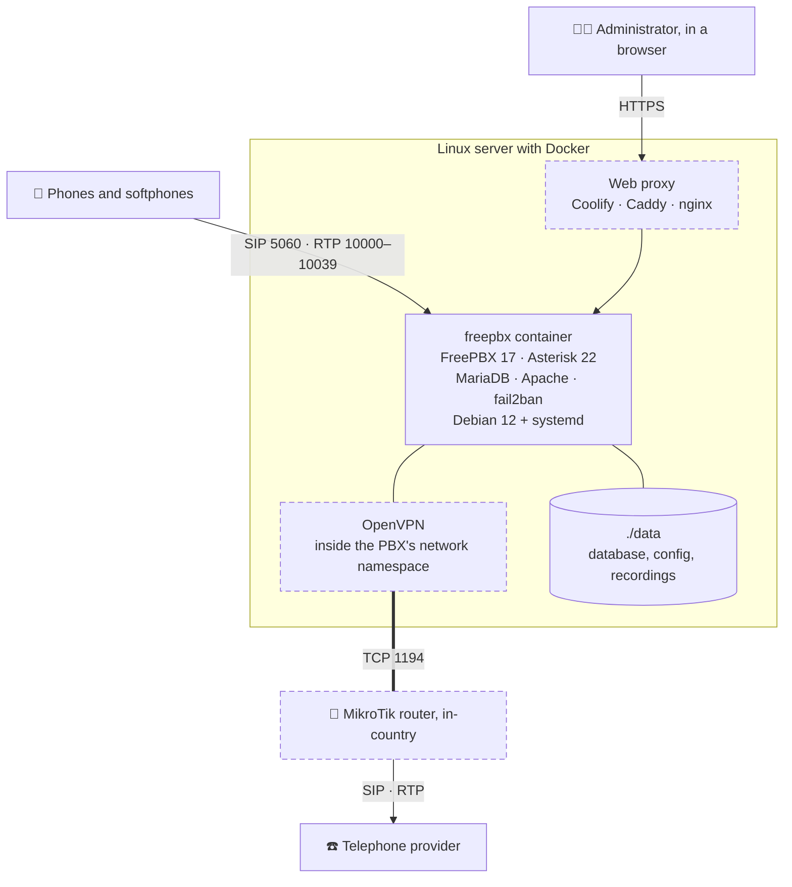

<p align="center">
  
</p>

<h3 align="center">The official FreePBX 17 in Docker — one command, and nothing else on the server has to move</h3>

<p align="center">
  <a href="https://github.com/mostafasadeghidev/freepbx-docker/releases/latest"></a>
  
  
  
  
  <a href="LICENSE"></a>
</p>

<p align="center" dir="ltr">
  <a href="README.md">فارسی</a> &nbsp;•&nbsp; <b>English</b>
</p>

<p align="center">
  <a href="#why">Why</a> ·
  <a href="#features">Features</a> ·
  <a href="#install">Install</a> ·
  <a href="#first-login">First login</a> ·
  <a href="#tools">Tools</a> ·
  <a href="#coolify">Coolify</a> ·
  <a href="#tunnel">Tunnel</a> ·
  <a href="#backup">Backup</a> ·
  <a href="#zana">Zana</a> ·
  <a href="#troubleshooting">Troubleshooting</a>
</p>

---

## <a name="why"></a>💡 Why this kit?

Sangoma publishes no official Docker image for FreePBX. The only supported way to install it is `sng_freepbx_debian_install.sh` on a clean **Debian 12** — and that is exactly what this kit reproduces: a Debian 12 container with a real systemd, running that same official script inside itself. FreePBX and Asterisk are the official builds; only the platform is a container.

The other "FreePBX on Docker" recipes are either community images four to ten years old, or they need `host` networking and collide with everything else on the machine:

| | The usual recipe | This kit |
|---|---|---|
| **Software** | A community image, four to ten years old | Sangoma's official installer — FreePBX 17 and Asterisk 22 |
| **Networking** | `network_mode: host`, fighting over ports 80 and 443 | Bridge networking; only SIP and a few dozen voice ports are published |
| **Recreating the container** | Erases the whole install | Automatic snapshot; a recreate takes seconds and loses nothing |
| **One-way audio** | Fixed by hand, after the first silent call | `nat.sh` sets it at the end of the install |
| **DNS inside the container** | Breaks silently and the trunk never registers | A fixed `resolv.conf`, and a healthcheck that asks exactly that |
| **Port clashes** | The container goes down and stays down | Before any change, it names who holds which port |

Every trap on this page happened once on a real install and was measured; wherever it could be, it became a script that prevents it rather than a warning.

## <a name="features"></a>✨ Features

<table>
<tr>
<td width="50%" valign="top">

🚀 **One command**<br>
`./setup.sh` asks a few questions with correct defaults, checks the ports, installs, and shows progress to the end. It also runs without a keyboard: every answer can come from a `SETUP_*` variable.

</td>
<td width="50%" valign="top">

🧊 **Recreates are safe**<br>
The container is snapshotted when the install finishes, and `apply.sh` refuses, before it starts, any change that would erase the install.

</td>
</tr>
<tr>
<td valign="top">

🔊 **Sound from the first call**<br>
`nat.sh` writes the public address and the voice port range through FreePBX's own module, then reads them back from Asterisk to prove they arrived.

</td>
<td valign="top">

🔌 **No port clashes**<br>
Before anything starts it names who holds which port — by name, e.g. `coolify-proxy` — and suggests a free port for the tunnel.

</td>
</tr>
<tr>
<td valign="top">

🩺 **A doctor that knows this setup**<br>
`doctor.sh` checks every fault that once happened on a real install — DNS, NAT, ports, firewall, trunks, snapshot — and changes nothing.

</td>
<td valign="top">

🌐 **On a Coolify server**<br>
The panel on your own domain with a Let's Encrypt certificate, through Coolify's proxy; voice goes straight in, no proxy.

</td>
</tr>
<tr>
<td valign="top">

🔗 **A tunnel to a router in-country**<br>
When the telephone provider only accepts an address inside its own country: OpenVPN inside the PBX's own network namespace, and one ready-to-paste line for a MikroTik terminal.

</td>
<td valign="top">

💾 **Backup and restore**<br>
Two files; a restore onto a fresh server takes about two minutes — rehearsed from zero on the test server.

</td>
</tr>
<tr>
<td valign="top">

🛡️ **Safe defaults**<br>
The panel only on `127.0.0.1`, a safe order for creating the administrator, fail2ban on, and FreePBX's firewall module — which breaks DNS and blocks healthy phones in a container — off.

</td>
<td valign="top">

🖥️ **Managed from Zana**<br>
Install, lines and extensions, health, opening the panel, publishing it on a domain and connecting a router — all from the [Zana](#zana) desktop app.

</td>
</tr>
</table>

## <a name="overview"></a>🧭 Overview



<p align="center"><sub>Dashed parts are optional. Most installs are just the phones, the freepbx container and the data folder.</sub></p>

## <a name="requirements"></a>📋 Requirements

| Needs | Details |
|---|---|
| **Server** | 64-bit Linux (amd64). The host distribution does not matter — the container brings its own Debian; only the kernel, architecture, cgroups and clock come from the host |
| **Docker** | Docker Engine and Docker Compose v2 |
| **cgroup v2** | `stat -fc %T /sys/fs/cgroup` must print `cgroup2fs` — Debian 12, Ubuntu 22.04 and newer do |
| **RAM** | 2 GB free; 4 GB is comfortable |
| **Disk** | 15 GB free |
| **Ports** | 5060 and the voice range (default 10000–10039) free on the host |
| **Internet during install** | Access to GitHub and the Debian and FreePBX repositories — from inside Iran it may not reach them; this kit was installed and tested on servers in Germany |

> [!IMPORTANT]
> It does not work on Docker Desktop for Windows or macOS: the container runs systemd as PID 1, with `privileged`.

> [!CAUTION]
> Do not change `FROM debian:12` in the `Dockerfile`. The official installer accepts **only** bookworm and stops on anything else (`Unsupported OS version. This script supports only Debian 12 (bookworm)`); since August 2025 it is deliberately pinned there and even blocks upgrades to Debian 13.

## <a name="install"></a>🚀 Quick install

On a server that has nothing but Docker:

```bash
git clone https://github.com/mostafasadeghidev/freepbx-docker.git
cd freepbx-docker
./setup.sh
```

What `setup.sh` does, in order:

1. Checks the machine — Docker, Compose, cgroup v2 and free disk. If something is missing it says so in one plain sentence and **writes no files**.
2. Asks a few questions — number of extensions, where the panel listens, SIP port, time zone, Coolify, tunnel — each with a correct default; <kbd>Enter</kbd> is enough.
3. Writes `.env` and `pbx.env` from the templates and checks the ports **before starting anything**.
4. Builds the image and runs the official installer inside the container — 20 to 40 minutes — showing progress to the end.
5. **Snapshots** the installed container, so no recreate can erase it.
6. Tells Asterisk its public address and voice port range (`nat.sh`).
7. Says the one thing left — create the administrator account — and, if you asked for a tunnel, prints the ready line for the router's terminal.

| Command | Does |
|---|---|
| `./setup.sh` | Asks, then installs |
| `./setup.sh --yes` | Asks nothing and takes every default |
| `./setup.sh --show` | Only shows what it would write; changes nothing |
| `./setup.sh --prepare` | Writes the files and checks the ports, but starts nothing |

For an unattended install — from another program, say — every question can be answered in the environment, without depending on the order of the questions; every answer is still validated:

```bash
SETUP_EXTENSIONS=50 SETUP_TUNNEL=listen SETUP_OPERATOR_NET=203.0.113.0/24 ./setup.sh --yes
```

The variables: `SETUP_EXTENSIONS`, `SETUP_PANEL_BIND`, `SETUP_PANEL_PORT`, `SETUP_SIP_PORT`, `SETUP_TZ`, `SETUP_DOMAIN`, `SETUP_COOLIFY`, `SETUP_PANEL_DOMAIN`, `SETUP_TUNNEL`, `SETUP_TUNNEL_PORT` and `SETUP_OPERATOR_NET` — each is described at the top of `setup.sh`.

> [!WARNING]
> Running `setup.sh` again on a folder where FreePBX is installed is **refused**: regenerating `.env` points the image back at the build image and erases the install. To change something, edit `.env` and run `./apply.sh`; for a tunnel, `./tunnel/listen.sh`.

### 📏 How many extensions?

The only thing size changes is the number of voice ports: two per extension, never fewer than forty. `setup.sh` works it out.

| Extensions | `RTP_END` | Voice ports | Simultaneous calls |
|---|---|---|---|
| up to 20 | `10039` | 40 | 20 |
| up to 50 | `10099` | 100 | 50 |
| up to 100 | `10199` | 200 | 100 |

To change it later: `RTP_END` in `.env`, then `./apply.sh` and `./nat.sh`.

Why not ten thousand ports? FreePBX's own default is 10000–20000 — ten thousand UDP ports, which Docker will not publish at any sensible speed, which is why most recipes fall back to `network_mode: host` and then collide with everything else on the machine. Twenty extensions do not need ten thousand ports.

> [!TIP]
> On a dedicated machine where you want the full RTP range, `compose.host-networking.yml` is the host-networking version: `docker compose -f compose.host-networking.yml up -d`

## <a name="first-login"></a>🔐 After install: the safe order for the first login

Until somebody opens the panel, FreePBX has **no administrator** — and the first person to open it becomes one, with no invitation and no check. So the order is:

1. **Install with the panel on the server only** — `PANEL_BIND=127.0.0.1`, the default. On a Coolify server, leave the domain question in `setup.sh` empty.
2. **Create the administrator through an SSH tunnel** — the panel is visible from nowhere else; the command is just below.
3. **Then, if you want a domain, publish it** — on Coolify with `compose.coolify.yml` ([below](#coolify)); with a Caddy or nginx installed directly on the server, by pointing it at `127.0.0.1:8088` — for Caddy a plain site block is enough and the certificate comes automatically.

The SSH tunnel for step 2, from your own computer:

```bash
ssh -L 8088:127.0.0.1:8088 root@<server>
```

Then open `http://127.0.0.1:8088` in a browser. Zana opens the same door without an `ssh -L`: "Phone system" → "Open the panel".

> [!CAUTION]
> Give a domain at the very start and the panel is on the internet from that moment, with no administrator; `setup.sh` says so at the end — create the administrator **right then**. This really happened on this kit's own test server: a panel on a public domain with a valid certificate, and zero administrator accounts. Every Let's Encrypt certificate is published in public Certificate Transparency logs within seconds; the address of an unclaimed panel is not a secret anyone has to guess.

### 🔊 Sound both ways — NAT

With bridge networking, Asterisk believes its address is `172.x.x.x` and writes exactly that into its SIP messages; the phone then sends its audio to an address that does not exist from outside. **The symptom: the call connects, it rings, you answer, and one side hears nothing.**

`setup.sh` fixes this itself with `./nat.sh`: it writes the public address and the voice range through FreePBX's own SIP settings module, reloads, and reads back from Asterisk itself that they arrived. Measured on a fresh install: FreePBX installs with `10000-20000` and no public address; after `nat.sh`, Asterisk reported `Port start: 10000 / Port end: 10039` and the address was on the transport.

```bash
./nat.sh --check                 # what Asterisk has now
./nat.sh                         # fix it (asks the internet for the address)
./nat.sh --address 203.0.113.7   # with an address you give
```

If the server's IP changes — a move to another server, or an address that is not static — run `./nat.sh` again; otherwise Asterisk keeps sending audio to the old address.

| Setting in `Settings → Asterisk SIP Settings` | Value | Who sets it |
|---|---|---|
| External Address | The server's public address | `nat.sh` |
| RTP Port Ranges | `RTP_START` to `RTP_END` from `.env` | `nat.sh` |
| Local Networks | This container's Docker subnet — the `eth0` line of `docker exec freepbx ip -4 route show scope link` | By hand |
| Media Address on a trunk that runs through the tunnel | The server's address inside the tunnel (default `10.97.0.1`) | By hand — [tunnel/README.md](tunnel/README.md) |

## <a name="tools"></a>🧰 Tools

All the scripts live in this folder, and none of them changes more than its name says.

| Script | Does | When |
|---|---|---|
| `./setup.sh` | First install: a few questions, port checks, install, snapshot and NAT | Once, on an empty server |
| `./apply.sh` | Applies `.env` — first checks that nobody holds its ports and that a recreate would not erase the install; `--check` only checks | Instead of `docker compose up -d`, after any change to `.env` |
| `./doctor.sh` | Checks the container, DNS, Asterisk, NAT, voice range, ports, firewall module, trunks and snapshot; touches nothing | Whenever something is odd |
| `./nat.sh` | Writes the public address and voice range into FreePBX and reads them back from Asterisk; `--check` and `--address` | After the IP or the voice range changes |
| `./snapshot.sh` | Turns the installed container into the image `freepbx17-official:installed` | After upgrading modules or Debian packages |
| `./tunnel/listen.sh` | Creates or updates the listening end of the tunnel on a running install; a second router with `--user` | To add a router |

> [!WARNING]
> **After any change to `.env`, run `./apply.sh` — not `docker compose up -d`.** Measured on a machine with Coolify and `TUNNEL_PORT=443`: compose recreated the telephone container to add the port, could not start the new one because Traefik held 443, and left **no telephone container running**. A port clash does not fail politely; it takes the system down.

Before any recreate, `apply.sh` asks two things: **who** holds which port — by name, e.g. `coolify-proxy`, not just `docker-proxy` — and whether the image a recreate would start from really has FreePBX in it (it looks inside the image itself, with no network and no pull). It works for a non-root user in the docker group, too.

`./doctor.sh` checks the same things and more, in this order:

| Section | Asks |
|---|---|
| Container | Is it running? What does the healthcheck say? Did the install finish? |
| Names and numbers | Does DNS work inside the container? Is Asterisk answering? |
| NAT | Is a public address set? Do FreePBX and `.env` agree on the voice range? How many UDP ports are published? |
| Ports | Does anything else on this machine hold a port this install publishes? |
| Firewall | Is FreePBX's firewall module off? |
| Load | How many extensions and trunks, how many registrations up, how many calls in progress |
| If this server disappeared tonight | Is there a snapshot? Does `.env` point at it? Does it really contain FreePBX? |

<details>
<summary><b>Everyday commands</b></summary>

```bash
docker compose exec freepbx fwconsole reload     # apply configuration
docker compose exec freepbx asterisk -rvvv       # Asterisk console
docker compose exec freepbx bash                 # a shell inside the container
```

</details>

<details>
<summary><b>Creating many extensions at once</b></summary>

One at a time from the panel form. For many, only `bulkimport` — not the API and not the database: `addDevice` and `addUser` read about 35 keys directly and die on the first missing one, and the half-made record then breaks `fwconsole reload` entirely (measured: `Undefined array key "account"`).

```bash
cat > ext.csv <<'EOF'
extension,name,description,tech,secret
101,Reception,,pjsip,<long-random-secret>
102,Office,,pjsip,<long-random-secret>
EOF
docker cp ext.csv freepbx:/tmp/ext.csv && rm ext.csv
docker compose exec -T freepbx fwconsole bulkimport --type=extensions /tmp/ext.csv --replace
docker compose exec -T freepbx fwconsole reload
docker compose exec -T freepbx rm /tmp/ext.csv
```

Two things that each cost time once: `--replace` is **required** even when there is nothing to replace — without it `bulkimport` never finishes the job. And without `fwconsole reload` the extensions are in the database but Asterisk does not know them yet: `pjsip show endpoints` shows nothing.

</details>

## <a name="coolify"></a>🌐 On a server that runs Coolify

This kit and Coolify share a machine without trouble — tested on Ubuntu 26.04, in both install orders:

- **No clashes:** Coolify takes ports 80, 443 (and 443/udp) and 8080 and sits itself on 8000; the telephone has 5060 and the voice range. Installing Coolify on a machine where the telephone was already running took **two minutes** and never touched the telephone container.
- **The panel on a domain:** `compose.coolify.yml` puts the panel on the `coolify` network and publishes it on your domain with a Let's Encrypt certificate through Traefik labels. Voice does not go through the proxy and never needs to — its ports are published directly.

**After creating the administrator** ([the safe order](#first-login)), in `.env`:

```ini
PANEL_DOMAIN=pbx.example.com
COMPOSE_FILE=compose.yml:compose.coolify.yml
```

then `./apply.sh`. With the tunnel: `COMPOSE_FILE=compose.yml:compose.coolify.yml:compose.tunnel-server.yml`.

- **In `.env`, not with `-f` on the command line** — otherwise the next `up -d`, by anyone or any tool, drops the Coolify file and the panel falls off the proxy.
- **From a terminal, not from inside Coolify's panel** — Coolify rewrites the compose file and renames things its own way, and then this folder is no longer yours.
- **Taking it off the domain** — remove `compose.coolify.yml` from `COMPOSE_FILE` and `./apply.sh`. A manual `docker network disconnect` only lasts until the next recreate. Zana does both with a button, and publishes only once an administrator account exists.

> [!WARNING]
> On a Coolify server, do not put the tunnel on port 443: Traefik holds 443 and 443/udp there.

<details>
<summary><b>Why "leave the panel on 127.0.0.1 and point Coolify at it" does not work</b></summary>

It is the obvious advice, and it is wrong. Measured from inside Coolify's own proxy:

```text
wget http://10.0.0.1:8088/   → Connection refused
wget http://freepbx:80/      → bad address 'freepbx'
```

The proxy lives in a container: it cannot reach a port bound to the **host's loopback**, and it cannot resolve a container on another network by name. The answer is the one any proxy in a container needs: attach the telephone container to the proxy's network — which is what `compose.coolify.yml` does.

</details>

## <a name="tunnel"></a>🔗 The tunnel — only if you need it

It exists for **one** situation: the telephone server is abroad, and the telephone provider only exchanges calls with an address inside its own country. The tunnel gives the telephone container a second address on that side, and the provider talks to that. If the server and the provider are in the same country, leave the tunnel off and never think about it again.

| | **The server listens** — almost always | **The server dials** |
|---|---|---|
| The in-country side | A router with no public address: an office line or a SIM, behind the carrier's NAT | A server with a public address that gave you an `.ovpn` file |
| Setup | Answer `listen` in `setup.sh`, or on a running install `./tunnel/listen.sh --net 203.0.113.0/24` with your provider's network | The file at `tunnel/client.ovpn`, `COMPOSE_PROFILES=tunnel` in `.env`, and `./apply.sh` |
| On the router | One ready line for the MikroTik terminal, name and password, no client certificate | — |

- **Inside the PBX itself:** with `network_mode: service:freepbx`, `tun0` and the provider's route are created in the telephone container's own network namespace, and Asterisk sees the tunnel address as its own; the host gets zero tun interfaces and zero routes.
- **Smooth voice over TCP:** the server template has `tcp-nodelay`. Without it, the TCP socket holds small voice packets back until the previous ones are acknowledged — measured on a real call: the tunnel's round trip rose from 98 ms to 230–270 ms.
- **The `iroute` trap:** the provider's network has to appear in both `route` and `iroute`; without the second, OpenVPN silently drops the packets and logs nothing.
- **Safe to run again:** `listen.sh` checks the port before writing anything, keeps an existing router's password, adds a second router with `--user`, and does not say "done" until OpenVPN is really listening. It refuses an install that has not been snapshotted yet, because opening the port recreates the container.

The full story, step by step, with the router lines and the traps: **[tunnel/README.md](tunnel/README.md)** (in Persian).

## <a name="backup"></a>💾 Backup and restore

`./data` on its own is not a backup: the software is not in it — it is in the snapshot image — and `./data` alone recreates, on a fresh server, the same "installed marker but no software" trap. A complete backup has three parts: the image, the data folder with the settings files, and the tunnel's secrets if you have a tunnel. In the kit folder, as root:

```bash
docker save freepbx17-official:installed | gzip > ../freepbx-image.tgz   # the phone stays up
docker compose stop                                                        # calls drop from here
tar czf ../freepbx-files.tgz data .env pbx.env \
    $(ls -d tunnel/users tunnel/server.conf tunnel/ccd tunnel/pki tunnel/client.ovpn 2>/dev/null)
docker compose start
```

> [!IMPORTANT]
> `freepbx-files.tgz` holds passwords and keys — `.env` and `pbx.env`, the database password in `data`, the tunnel's keys — so keep it like a password. And keep both files **somewhere other than this server**: a backup on the same disk dies with that disk.

Restoring, on a server that has only Docker:

```bash
git clone https://github.com/mostafasadeghidev/freepbx-docker.git
cd freepbx-docker
tar xzf ../freepbx-files.tgz
gunzip -c ../freepbx-image.tgz | docker load
./apply.sh
./nat.sh              # the new server's public address
```

If the server changed: point the router's tunnel `connect-to` at the new address, and the panel domain's DNS if it has one. On a server without Coolify, remove `compose.coolify.yml` from `COMPOSE_FILE` in `.env`.

**Rehearsed on the test server:** a backup was taken, the folder and the image were both deleted, and everything came back from those two files alone — the administrator account, extensions, tunnel, panel and domain — with `doctor.sh` reporting no failures.

| Step | Time | Size |
|---|---|---|
| Saving the image, phone running | 139 s | 1.75 GB |
| Stop, archive the files, start | 162 s of downtime | 1.19 GB |
| Restore: files, image load, `apply.sh` | 128 s | — |

What lives only in the container's own layer — phone firmware FreePBX downloads later (about 1 GB on the test server) and logs — is not in the backup and does not need to be; it is rebuilt.

<details>
<summary><b>Where the data lives</b></summary>

Everything is in `./data/` next to this file, and Docker creates its folders on the first run:

| Path | Contents |
|---|---|
| `data/mysql` | The MariaDB database |
| `data/etc-asterisk` | Asterisk configuration |
| `data/lib-asterisk` | Sound files and modules |
| `data/spool-asterisk` | Voicemail, call recordings, queues |
| `data/www` | The web panel |
| `data/log-asterisk`, `data/log-pbx` | Logs |
| `data/persist` | `freepbx.conf`, `odbc.ini` and the "install finished" marker |

To install from scratch: `docker compose down`, delete all of `./data/`, the snapshot image too (`docker image rm freepbx17-official:installed`), then `./setup.sh`. Removing only the `data/persist/.freepbx-installed` marker is **not** enough — an install does not land on top of old data ([troubleshooting](#troubleshooting)).

</details>

## <a name="zana"></a>🖥️ Managed from Zana

Zana is a desktop app for managing servers over SSH, and it knows this kit. What this page does with commands, it does in a few clicks:

- **Install from a form** — asks for the folder, the number of extensions, Coolify and the tunnel, and runs this same `setup.sh` on the server. Close the laptop and the install carries on on the server; Zana re-attaches to it.
- **Lines and extensions** — trunk registrations, every extension and every handset behind it with its round-trip time, and the calls in progress; read-only, and no paid FreePBX module needed.
- **Health** — DNS, public address, voice range, administrator account, an "Apply Config" nobody pressed, a stuck container, and the risk of a recreate erasing the install; one-way audio fixed with one button (`nat.sh`).
- **The panel without a manual tunnel** — a panel bound to the server's `127.0.0.1` opens in your own browser over Zana's existing SSH connection, and closes after 15 idle minutes.
- **A domain with one button** — "Publish" and "Take it off the domain" on Coolify; publishing is refused until an administrator account exists.
- **The tunnel from both ends** — which routers are connected, since when, and the drops of the last 24 hours; building the server side, and connecting a router — one you manage in Zana, or ready lines for one you don't.

## <a name="security"></a>🛡️ Security

| Port | Use | Published on |
|---|---|---|
| `5060/udp`, `5060/tcp` | SIP | All interfaces |
| `10000-10039/udp` | RTP (voice) | All interfaces |
| `8088/tcp` | Web panel | **`127.0.0.1` only** |
| `1194/tcp` | The tunnel, if enabled | All interfaces |
| `5061/tcp` | SIP over TLS | Commented out in `compose.yml` |

> [!CAUTION]
> The moment 5060 is open, scanners find it within hours. They are not after vandalism but free international calls — and you pay the bill.

- **Every extension's secret** long and random, not `1234`.
- **fail2ban inside the container** is on and bans repeated failed logins.
- **FreePBX's own Firewall module** stays off in this container: it breaks DNS and blocks healthy phones — see [troubleshooting](#troubleshooting).
- **Restrict 5060** to your phones' addresses, if they are static, in your hosting provider's firewall (the Cloud Firewall in its panel) — not with `ufw`: a port Docker publishes is handled before `ufw`'s rules and `ufw` has no effect on it.
- **If your hosting provider has a firewall in front of the machine**, 5060 and the whole voice range (UDP) must be open there as well; otherwise the result is the same one-way audio.
- **The container is `privileged`** — systemd as PID 1 needs it — so it has no serious isolation from the host. Treat the server as if FreePBX were installed on it directly.

## <a name="troubleshooting"></a>🩺 Troubleshooting and traps

The first step is always:

```bash
./doctor.sh
```

Everything it checks once broke on a real install; it touches nothing and only reports what it saw. The traps behind those checks:

<details>
<summary><b>🧨 Recreating the container erases the whole install — and why the snapshot</b></summary>

**Volumes keep the data, not the software.** The installer writes mariadb, apache, php, asterisk and their systemd units into the **container's own filesystem**, and that filesystem is rebuilt from the image every time `docker compose up` recreates the container. Pressing "update" in a UI is enough.

What is left is worse than a clean slate: `./data` still carries the "installed" marker, so `bootstrap.sh` skips the install and starts services that no longer exist:

```text
Failed to start mariadb.service: Unit mariadb.service not found.
```

Measured on this very kit: one `docker compose up -d` to apply an override wiped the whole install. The README had warned about it from day one and that was **not enough** — so now `setup.sh` runs `./snapshot.sh` itself when the install finishes, and writes into `.env`:

```ini
PBX_IMAGE=freepbx17-official:installed
```

`compose.yml` is not edited and its `build:` block stays; from then on a recreate starts from the installed state and takes seconds. The same override was applied again and `fwconsole`, Asterisk, mariadb and apache all stayed.

> After anything that changes the **software** — `fwconsole ma upgradeall`, Debian package upgrades, installing a module — run `./snapshot.sh` again. Not needed for **data** changes (new extensions, settings); those live in the volumes.

**And reinstalling over the old data does not work.** It is tempting to remove the marker and let the installer run again; measured: the `freepbx17` package installs but `/usr/sbin/fwconsole` is never created, because `/var/www/html` is full from the previous install and the package skips that step (`line 1304: fwconsole: command not found`). The only clean way: back up `./data`, `docker compose down`, delete all of `./data`, and install fresh.

</details>

<details>
<summary><b>⛔ Never after install: <code>docker compose build</code> or <code>up -d --build</code></b></summary>

Compose builds only when the image `PBX_IMAGE` names does not exist — and after an install, that is exactly the dangerous moment. These two commands build a **fresh, empty** image and give it the snapshot's name; the next recreate erases the install. Measured with throwaway containers shaped like this kit, on Docker 29: after `docker compose build` and one `up -d`, `fwconsole` was gone.

The same happens when an automatic image clean-up deletes the snapshot — Coolify's periodic clean-up did exactly that on the test server.

Before any recreate, `./apply.sh` checks whether the image the recreate would start from really has FreePBX, and refuses if not; `./doctor.sh` shows the same in red. If it happens, the running container still has the install: run `./snapshot.sh` again so the snapshot's name points at the install once more.

</details>

<details>
<summary><b>🌐 The container cannot resolve names (DNS)</b></summary>

The FreePBX container was the only one on its host that resolved no names at all; every other container was fine. In practice that is worse than it sounds: a PBX with no DNS can neither update modules nor resolve its trunk's host name — so outgoing calls fail silently.

Two causes stacked up. Docker puts an internal DNS on `127.0.0.11` that works only through a NAT rule inside the container's own network namespace, and FreePBX's firewall module together with fail2ban rewrites the whole iptables table and wipes that rule. But even with the module off and the container recreated — NAT rules back in place — the embedded resolver itself did not answer. Three raw DNS queries from inside the same container:

```text
127.0.0.11 (Docker's resolver)  →  TimeoutError
1.1.1.1                         →  answered
```

**`dns:` in compose does not fix it** — tested. Docker still writes `nameserver 127.0.0.11` into `resolv.conf` and uses the `dns:` list only as that resolver's upstreams.

**What works:** this repository's `resolv.conf` is mounted read-only over the container's file (`./resolv.conf:/etc/resolv.conf:ro`) — it survives restarts and recreates, because it is a bind mount. The cost: the container can no longer resolve other containers by name, which it never needs — mariadb, apache and asterisk all live inside this one container. The file ships with public resolvers; if your hosting provider runs its own, you may put it first.

**The symptom is far from the fault:** with DNS broken, Asterisk cannot resolve the trunk and **sends no SIP at all** — while a manual probe by IP from the same container gets `200 OK`. And because Asterisk resolves names only when it starts, `fwconsole restart` is required after fixing DNS. That is why the `healthcheck` in `compose.yml` asks exactly this: a container that cannot resolve names shows as `unhealthy`, instead of surfacing hours later as "the phones will not register".

```bash
docker exec freepbx getent hosts voip.example.ir   # empty = this problem
```

</details>

<details>
<summary><b>🔥 FreePBX's firewall module is off in the container</b></summary>

`PBX_FIREWALL=off` is the default and `bootstrap.sh` applies it on **every** boot — every boot, because a module update can switch it back on.

On an ordinary PBX that module is the right tool; in a container it is not: it assumes it owns the machine's netfilter, while Docker has rules in the same network namespace. Two failures, measured on a live system:

1. **It wipes Docker's DNS rule** — the one described above.
2. **It blocks healthy clients.** `fpbxratelimit` puts a source on the `ATTACKER` list after about 100 packets in 300 seconds — which a busy softphone reaches — and silently `DROP`s it. Every dropped packet re-arms the timer, so a client that keeps retrying **keeps its own ban alive**. It looks like "Request Timeout", never like "wrong password".

fail2ban is separate, untouched and stays on — and it blocks what actually matters. If you want the module anyway, set `PBX_FIREWALL=on` in `pbx.env`. For a container that is already caught:

```bash
docker exec freepbx fwconsole firewall disable
docker exec freepbx grep <IP> /proc/net/xt_recent/ATTACKER          # anyone banned?
docker exec freepbx sh -c 'echo -<IP> > /proc/net/xt_recent/ATTACKER'
```

</details>

<details>
<summary><b>📦 <code>--opensourceonly</code> breaks the install</b></summary>

Measured on installer version 1.15: the flag does **not** install the commercial modules and then tries to remove them anyway:

```text
xargs -t -I {} fwconsole ma -f remove {}
Error at line: 1293 exiting with code 123
```

`xargs` exits 123 when any of its calls fails, and `set -e` kills the script right there — **after everything is installed and working**; the log said "not installed" 116 times. So leave `INSTALL_ARGS` empty in `pbx.env`: the commercial modules get installed but do nothing without a licence; they cost disk, not behaviour.

</details>

<details>
<summary><b>🌍 Every install comes from the internet</b></summary>

The official installer is downloaded fresh each time (the `master` branch), and it pulls its packages from the Debian and FreePBX repositories. So:

- **Two installs two months apart are not necessarily identical.** To make them so, pin the version: open the `INSTALLER_URL` line in `pbx.env` and replace `master` with a specific commit.
- **The server has to reach GitHub and those repositories.** From inside Iran it may not.

After the install, the snapshot is the fixed version: with a [complete backup](#backup) you move exactly that to another server, without installing from the internet again.

</details>

<details>
<summary><b>📜 Where the install log is</b></summary>

With systemd as PID 1, the installer's output goes to the journal inside the container, not to `docker compose logs`. `setup.sh` shows the progress itself; the installer's full log is here:

```bash
docker exec freepbx tail -f /var/log/pbx/freepbx17-install-*.log
```

The install ends with `[bootstrap] FreePBX installation finished.` — and watch the host's RAM while it runs: it is the riskiest moment, and if memory runs out the kernel kills a process that may belong to something else on the same server.

</details>

<details>
<summary><b>🏠 Debian's default page appears instead of FreePBX</b></summary>

The apache2 package puts its own `index.html` in the web root, and Apache serves it **before** FreePBX's `index.php` (`DirectoryIndex index.html index.cgi index.pl index.php ...`). If you see that page, move it aside:

```bash
docker exec freepbx mv /var/www/html/index.html /var/www/html/index.html.debian-default
```

</details>

<details>
<summary><b>⚠️ The "77 tampered files" warning is a false alarm</b></summary>

After the install, the panel says in red that dozens of files have been altered. Checked:

| Check | Result |
|---|---|
| framework files | 8084 files, 26 errors |
| types of the flagged files | 22 png, 3 zip, 1 gz |
| php, js, sh, conf, sql | zero |

The real difference in `amp.png` is exactly **9 bytes** — the PNG `tIME` chunk, i.e. the file's creation date, plus its four-byte CRC:

```text
original : 07d7 060e 161b 32   →  2007-06-14
installed: 07e9 0909 0b17 32   →  2025-09-09
```

In `test.tar.gz`, exactly **4 bytes**: the mtime field of the gzip header. The image data and the compressed contents are byte-for-byte identical. So FreePBX's Debian package is built with reproducible-build tools that normalise the timestamps embedded in png, zip and gz, while the module signature (`module.sig`) is based on the untouched upstream tarball. Every binary file with an embedded timestamp gets flagged, and no code file does. One file really is missing — `incoming-call-no-longer-avail.sln`, a sound file.

</details>

<details>
<summary><b>🔁 A change that never applied: <code>docker restart</code> vs <code>./apply.sh</code></b></summary>

`docker restart` and rebooting the server both bring the container up with its **existing** configuration and never read `compose.yml`. Only a recreate applies a compose change — and do the recreate with `./apply.sh`, which first checks the install survives. A change written but never applied is the worst state: it looks done and behaves broken.

```bash
./apply.sh                 # recreate, after checking the install survives
docker restart freepbx     # this does not read compose
```

</details>

<details>
<summary><b>⚙️ Why privileged, and why systemd</b></summary>

The official script runs under `set -e` and calls `systemctl` in several places; without a real systemd the first `systemctl` blows the install up halfway. So the container boots `/sbin/init` as PID 1, which is what requires `privileged: true` — writing to cgroups, and iptables for the modules. It is also why the install cannot happen while the image is built and runs on the first boot instead.

</details>

## <a name="measured"></a>📊 Measured, not estimated

Every number in this section comes from a real run. Clean server: Ubuntu 26.04 LTS, 2 cores, 3.8 GB RAM, 38 GB disk.

| Step | Result |
|---|---|
| Bare server, no Docker | `setup.sh` refuses in one plain sentence and **writes no files** |
| FreePBX install, alone on the machine | **20 minutes** |
| The same install beside Coolify on the same two cores | **30 minutes** |
| Published ports | 41 UDP ports (40 voice plus SIP), the panel on `127.0.0.1` only |
| SIP from outside | `SIP/2.0 401 Unauthorized` with `Server: FPBX-17.0.33` |
| Installing Coolify beside a running telephone | **2 minutes**, no port clash, telephone container untouched |
| Disk used at the end | 13 GB, including Coolify and the snapshot image |

The tunnel, from a server in Germany to a MikroTik router (RouterOS 7) in Iran:

| | Result |
|---|---|
| The right direction | **The server listens, the router connects** — both of the router's lines had addresses in `100.64.0.0/10`, i.e. carrier NAT |
| Authentication | Name and password, **no client certificate** — what a MikroTik `ovpn-client` speaks |
| Inside the telephone container | `tun0 10.97.0.1/24` and the provider's route via `10.97.0.2` — on the host, **zero** tun interfaces and zero routes |
| Pinging the provider through the tunnel | 0% loss, 170 ms |
| The provider's SIP answer | `SIP/2.0 603` from inside the container, with plain Docker and with Coolify |
| Port | 1194, because Traefik holds 443 on a Coolify machine |

**Not tested yet:** a real trunk registration through this kit — with the same provider credentials, registering from a second server would have taken the registration away from the production system; what was tested is the provider's own answer to a REGISTER without credentials, which proves the path and registers nothing. And a complete voice call: an extension was created and a test handset registered to it from the internet, but audio flowing both ways through the published range has not been measured on this kit.

## <a name="layout"></a>📁 Repository layout

```text
freepbx-docker/
├── setup.sh                     first install, one command
├── apply.sh                     applies .env after checking ports and recreates
├── doctor.sh                    the doctor; only reads
├── nat.sh                       public address and voice range
├── snapshot.sh                  installed container → image
├── compose.yml                  the main service (bridge networking)
├── compose.coolify.yml          the panel through Coolify's proxy
├── compose.tunnel-server.yml    the tunnel: the server listens
├── compose.host-networking.yml  the network_mode: host version
├── Dockerfile                   Debian 12 + systemd + the official installer
├── .env.example                 size, ports, image, files
├── pbx.env.example              settings for the installer inside the container
├── resolv.conf                  the container's fixed DNS
├── scripts/                     bootstrap, port and recreate checks
└── tunnel/                      OpenVPN, templates and the tunnel guide
```

**Move this whole folder with `git clone`** — not pieces of it. The scripts lean on each other, and `resolv.conf` is mounted into the container: if it is missing, Docker creates a **directory** in its place and the container does not start at all (`Are you trying to mount a directory onto a file`). `git clone` also keeps the scripts executable, which a manual copy does not. `setup.sh` creates `.env` and `pbx.env`, and Docker creates `data/`.

This repository is safe to be public: `.gitignore` keeps everything sensitive out of git — `.env` and `pbx.env`, the `data/` folder (the database with the password the installer generates, voicemail and **call recordings**), the tunnel's keys and passwords, and logs. There is no IP address, domain, email or key in this repository's files.

## 📚 References

- [FreePBX 17 Installation — Sangoma](https://sangomakb.atlassian.net/wiki/spaces/FP/pages/230326391/FreePBX+Open+Source+-+FreePBX+17+Installation)
- [The official install script](https://github.com/FreePBX/sng_freepbx_debian_install)
- [Step By Step Debian 12 Installation](https://sangomakb.atlassian.net/wiki/spaces/FP/pages/295403538/FreePBX+Open+Source+-+Step+By+Step+Debian+12+Installation)
- [Community discussion of FreePBX 17 with Docker](https://community.freepbx.org/t/freepbx-17-installation-with-docker/104313)

## 📄 License

This kit is released under the [MIT](LICENSE) license. FreePBX and Asterisk are Sangoma's software under their own licences, and this repository ships neither: the official installer fetches them onto your own server — along with Sangoma's commercial modules — which is why no pre-installed image is published here.

<p align="center"><sub>If this kit helped you, a ⭐ says so.</sub></p>
