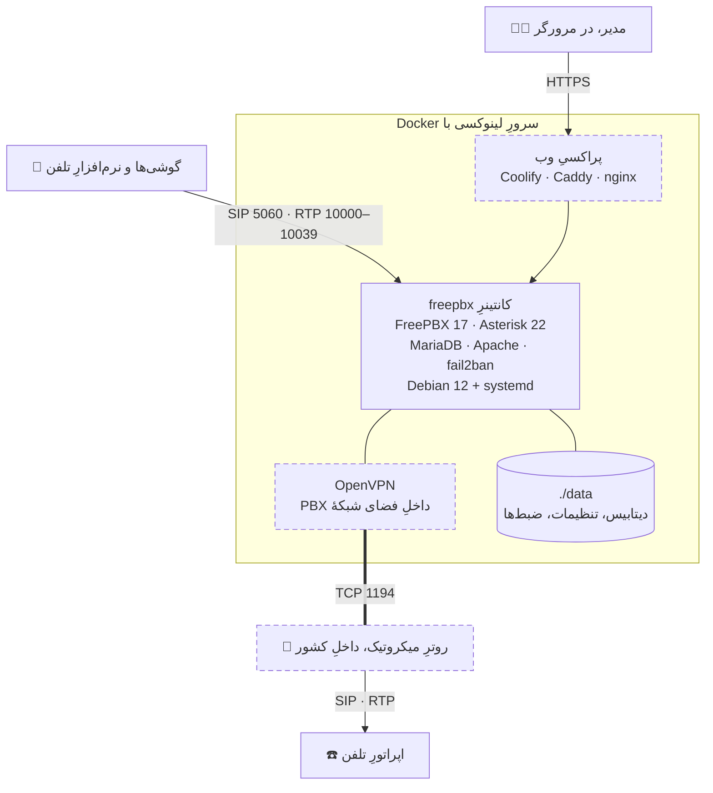

<p align="center">
  
</p>

<h3 align="center" dir="rtl">تلفن‌خانهٔ رسمیِ FreePBX 17 داخلِ Docker — با یک فرمان، و بی‌آنکه چیزی روی سرور جابه‌جا شود</h3>

<p align="center">
  <a href="https://github.com/mostafasadeghidev/freepbx-docker/releases/latest"></a>
  
  
  
  
  <a href="LICENSE"></a>
</p>

<p align="center" dir="rtl">
  <b>فارسی</b> &nbsp;•&nbsp; <a href="README.en.md">English</a>
</p>

<p align="center" dir="rtl">
  <a href="#why">چرا این کیت</a> ·
  <a href="#features">امکانات</a> ·
  <a href="#install">نصب</a> ·
  <a href="#first-login">اولین ورود</a> ·
  <a href="#tools">ابزارها</a> ·
  <a href="#coolify">Coolify</a> ·
  <a href="#tunnel">تونل</a> ·
  <a href="#backup">پشتیبان</a> ·
  <a href="#zana">زانا</a> ·
  <a href="#troubleshooting">عیب‌یابی</a>
</p>

---

## <a name="why"></a>💡 چرا این کیت؟

سنگوما (Sangoma) هیچ ایمیجِ رسمیِ Docker برای FreePBX منتشر نمی‌کند. تنها راهِ نصبِ رسمی، اجرای ⁦`sng_freepbx_debian_install.sh`⁩ روی یک **Debian 12** تمیز است — و این کیت دقیقاً همان را بازتولید می‌کند: یک کانتینرِ دبیانِ ۱۲ با systemd واقعی، که همان اسکریپتِ رسمی را داخلِ خودش اجرا می‌کند. نسخهٔ FreePBX و Asterisk کاملاً رسمی است؛ فقط بستر، کانتینر است.

بقیهٔ راه‌های «FreePBX روی Docker» یا ایمیج‌هایی از جامعه‌اند که چهار تا ده سال قدمت دارند، یا شبکهٔ ⁦`host`⁩ می‌خواهند و با هر چیزِ دیگری روی سرور تصادف می‌کنند:

<div dir="rtl">

| | راهِ معمول | این کیت |
|---|---|---|
| **نرم‌افزار** | ایمیجِ جامعه، چهار تا ده سال قدیمی | نصب‌کنندهٔ رسمیِ Sangoma — FreePBX 17 و Asterisk 22 |
| **شبکه** | ⁦`network_mode: host`⁩ و تصادف سرِ پورت‌های ۸۰ و ۴۴۳ | شبکهٔ bridge؛ فقط SIP و چند ده پورتِ صدا منتشر می‌شود |
| **بازسازیِ کانتینر** | کلِ نصب پاک می‌شود | اسنپ‌شاتِ خودکار؛ بازسازی چند ثانیه است و چیزی از دست نمی‌رود |
| **صدای یک‌طرفه** | بعد از اولین تماسِ بی‌صدا، دستی | ⁦`nat.sh`⁩ در پایانِ نصب خودش درستش می‌کند |
| **DNS داخلِ کانتینر** | بی‌صدا می‌شکند و ترانک ثبت نمی‌شود | ⁦`resolv.conf`⁩ ثابت، و healthcheckی که همین را می‌پرسد |
| **تداخلِ پورت** | کانتینر پایین می‌رود و پایین می‌ماند | پیش از هر تغییر می‌گوید کدام پورت را چه کسی گرفته |

</div>

هر تله‌ای که در این صفحه می‌بینید یک بار روی یک نصبِ واقعی پیش آمده و اندازه‌گیری شده است؛ و هر جا ممکن بوده، به‌جای یک هشدار، اسکریپتی شده که جلویش را می‌گیرد.

## <a name="features"></a>✨ امکانات

<table dir="rtl">
<tr>
<td width="50%" valign="top">

🚀 **نصب با یک فرمان**<br>
⁦`./setup.sh`⁩ چند سؤال با پیش‌فرضِ درست می‌پرسد، پورت‌ها را می‌سنجد، نصب می‌کند و تا پایان پیشرفت را نشان می‌دهد. بی‌کیبورد هم می‌شود: هر جواب از یک متغیرِ ⁦`SETUP_*`⁩.

</td>
<td width="50%" valign="top">

🧊 **بازسازیِ بی‌خطر**<br>
در پایانِ نصب از کانتینر اسنپ‌شات گرفته می‌شود، و ⁦`apply.sh`⁩ هر تغییری را که نصب را پاک کند پیش از شروع رد می‌کند.

</td>
</tr>
<tr>
<td valign="top">

🔊 **صدا از همان تماسِ اول**<br>
⁦`nat.sh`⁩ آدرسِ عمومی و بازهٔ پورتِ صدا را از راهِ ماژولِ خودِ FreePBX می‌نویسد و از Asterisk بازمی‌خواند که واقعاً رسیده باشد.

</td>
<td valign="top">

🔌 **بی‌تصادفِ پورت**<br>
پیش از روشن کردنِ هر چیز می‌گوید کدام پورت را چه کسی گرفته — به اسم، مثلاً ⁦`coolify-proxy`⁩ — و برای تونل پورتِ آزاد پیشنهاد می‌دهد.

</td>
</tr>
<tr>
<td valign="top">

🩺 **عیب‌یابِ آماده**<br>
⁦`doctor.sh`⁩ هر خرابی‌ای را که یک بار روی نصبِ واقعی پیش آمد می‌سنجد — DNS، NAT، پورت‌ها، فایروال، ترانک‌ها و اسنپ‌شات — و به چیزی دست نمی‌زند.

</td>
<td valign="top">

🌐 **روی سرورِ Coolify**<br>
پنل روی دامنهٔ خودتان با گواهیِ Let's Encrypt، از راهِ پراکسیِ Coolify؛ صدا مستقیم و بی‌پراکسی.

</td>
</tr>
<tr>
<td valign="top">

🔗 **تونل به روترِ داخلِ کشور**<br>
اگر اپراتورِ تلفن فقط آدرسِ داخلِ کشور را می‌پذیرد: OpenVPN داخلِ فضای شبکهٔ خودِ PBX، و یک خطِ آماده برای ترمینالِ میکروتیک.

</td>
<td valign="top">

💾 **پشتیبان و برگرداندن**<br>
دو فایل؛ و برگرداندن روی سرورِ تازه در حدودِ دو دقیقه — از صفر، روی سرورِ تست تمرین شده است.

</td>
</tr>
<tr>
<td valign="top">

🛡️ **پیش‌فرض‌های امن**<br>
پنل فقط روی ⁦`127.0.0.1`⁩، ترتیبِ امن برای ساختنِ مدیر، fail2ban روشن، و ماژولِ فایروالِ FreePBX — که در کانتینر DNS و گوشیِ سالم را می‌بندد — خاموش.

</td>
<td valign="top">

🖥️ **مدیریت با زانا**<br>
نصب، خط‌ها و داخلی‌ها، سلامتِ سیستم، باز کردنِ پنل، انتشار روی دامنه و وصل کردنِ روتر — همه از داخلِ برنامهٔ دسکتاپِ [زانا](#zana).

</td>
</tr>
</table>

## <a name="overview"></a>🧭 نمای کلی



<p align="center" dir="rtl"><sub>قسمت‌های خط‌چین اختیاری‌اند. بیشترِ نصب‌ها فقط گوشی‌ها، کانتینرِ freepbx و پوشهٔ data را دارند.</sub></p>

## <a name="requirements"></a>📋 پیش‌نیازها

<div dir="rtl">

| نیاز | جزئیات |
|---|---|
| **سرور** | لینوکسِ ۶۴ بیتی (amd64). توزیعِ هاست مهم نیست — کانتینر دبیانِ خودش را می‌آورد؛ از هاست فقط هسته، معماری، cgroup و ساعت می‌آید |
| **Docker** | Docker Engine و Docker Compose v2 |
| **cgroup v2** | خروجیِ ⁦`stat -fc %T /sys/fs/cgroup`⁩ باید ⁦`cgroup2fs`⁩ باشد — Debian 12، Ubuntu 22.04 و تازه‌تر همین‌اند |
| **رم** | ۲ گیگ آزاد؛ ۴ گیگ راحت‌تر |
| **دیسک** | ۱۵ گیگ آزاد |
| **پورت‌ها** | ۵۰۶۰ و بازهٔ صدا (پیش‌فرض ۱۰۰۰۰ تا ۱۰۰۳۹) روی هاست آزاد باشند |
| **اینترنت هنگامِ نصب** | دسترسی به GitHub و مخزن‌های Debian و FreePBX — از داخلِ ایران ممکن است نرسد؛ این کیت روی سرورهایی در آلمان نصب و آزموده شده است |

</div>

> [!IMPORTANT]
> روی Docker Desktop ویندوز یا مک کار نمی‌کند: کانتینر systemd را به‌عنوانِ PID 1 و با ⁦`privileged`⁩ اجرا می‌کند.

> [!CAUTION]
> در ⁦`Dockerfile`⁩، خطِ ⁦`FROM debian:12`⁩ را عوض نکنید. نصب‌کنندهٔ رسمی **فقط** bookworm را قبول می‌کند و روی هر چیزِ دیگری می‌ایستد (⁦`Unsupported OS version. This script supports only Debian 12 (bookworm)`⁩)؛ از آگوستِ ۲۰۲۵ عمداً به آن سنجاق شده و حتی جلوی ارتقا به دبیانِ ۱۳ را می‌گیرد.

## <a name="install"></a>🚀 نصبِ سریع

روی سروری که فقط Docker دارد:

```bash
git clone https://github.com/mostafasadeghidev/freepbx-docker.git
cd freepbx-docker
./setup.sh
```

آنچه ⁦`setup.sh`⁩ انجام می‌دهد، به ترتیب:

1. ماشین را می‌سنجد — Docker، Compose، cgroup v2 و فضای دیسک. اگر چیزی کم باشد با یک جملهٔ روشن می‌ایستد و **هیچ فایلی نمی‌نویسد**.
2. چند سؤال می‌پرسد — تعدادِ داخلی‌ها، نشانیِ پنل، پورتِ SIP، منطقهٔ زمانی، Coolify و تونل — که همه پیش‌فرضِ درست دارند؛ <kbd>Enter</kbd> کافی است.
3. ⁦`.env`⁩ و ⁦`pbx.env`⁩ را از روی الگوها می‌نویسد و **پیش از روشن کردنِ هر چیز** پورت‌ها را می‌سنجد.
4. ایمیج را می‌سازد و نصب‌کنندهٔ رسمی را داخلِ کانتینر اجرا می‌کند — ۲۰ تا ۴۰ دقیقه — و تا پایان پیشرفت را نشان می‌دهد.
5. از کانتینرِ نصب‌شده **اسنپ‌شات** می‌گیرد، تا هیچ بازسازی‌ای نصب را پاک نکند.
6. آدرسِ عمومی و بازهٔ پورتِ صدا را به Asterisk می‌دهد (⁦`nat.sh`⁩).
7. تنها کارِ باقی‌مانده را می‌گوید — ساختنِ حسابِ مدیر — و اگر تونل خواسته باشید، خطِ آمادهٔ ترمینالِ روتر را چاپ می‌کند.

<div dir="rtl">

| فرمان | کار |
|---|---|
| ⁦`./setup.sh`⁩ | می‌پرسد، بعد نصب می‌کند |
| ⁦`./setup.sh --yes`⁩ | هیچ نمی‌پرسد و همهٔ پیش‌فرض‌ها را می‌گیرد |
| ⁦`./setup.sh --show`⁩ | فقط نشان می‌دهد چه می‌نویسد؛ چیزی عوض نمی‌شود |
| ⁦`./setup.sh --prepare`⁩ | فایل‌ها را می‌نویسد و پورت‌ها را می‌سنجد، ولی چیزی را روشن نمی‌کند |

</div>

برای نصبِ بی‌کیبورد — مثلاً از یک برنامه — هر سؤال را می‌شود از محیط جواب داد، بی‌آنکه به ترتیبِ سؤال‌ها وابسته باشد؛ هر جواب باز هم اعتبارسنجی می‌شود:

```bash
SETUP_EXTENSIONS=50 SETUP_TUNNEL=listen SETUP_OPERATOR_NET=203.0.113.0/24 ./setup.sh --yes
```

متغیرها: ⁦`SETUP_EXTENSIONS`⁩، ⁦`SETUP_PANEL_BIND`⁩، ⁦`SETUP_PANEL_PORT`⁩، ⁦`SETUP_SIP_PORT`⁩، ⁦`SETUP_TZ`⁩، ⁦`SETUP_DOMAIN`⁩، ⁦`SETUP_COOLIFY`⁩، ⁦`SETUP_PANEL_DOMAIN`⁩، ⁦`SETUP_TUNNEL`⁩، ⁦`SETUP_TUNNEL_PORT`⁩ و ⁦`SETUP_OPERATOR_NET`⁩ — شرحِ هرکدام بالای ⁦`setup.sh`⁩ است.

> [!WARNING]
> اجرای دوبارهٔ ⁦`setup.sh`⁩ روی پوشه‌ای که FreePBX در آن نصب است **رد می‌شود**: ساختنِ دوبارهٔ ⁦`.env`⁩ ایمیج را به ایمیجِ ساخت برمی‌گرداند و نصب را پاک می‌کند. برای تغییر، ⁦`.env`⁩ را ویرایش کنید و ⁦`./apply.sh`⁩ بزنید؛ برای تونل، ⁦`./tunnel/listen.sh`⁩.

### 📏 چند داخلی؟

تنها چیزی که با اندازه عوض می‌شود تعدادِ پورتِ صداست: دو پورت برای هر داخلی، و هیچ‌وقت کمتر از چهل. ⁦`setup.sh`⁩ خودش حساب می‌کند.

<div dir="rtl">

| داخلی | ⁦`RTP_END`⁩ | پورتِ صدا | تماسِ هم‌زمان |
|---|---|---|---|
| تا ۲۰ | ⁦`10039`⁩ | ۴۰ | ۲۰ |
| تا ۵۰ | ⁦`10099`⁩ | ۱۰۰ | ۵۰ |
| تا ۱۰۰ | ⁦`10199`⁩ | ۲۰۰ | ۱۰۰ |

</div>

برای تغییرِ بعدی: ⁦`RTP_END`⁩ در ⁦`.env`⁩، بعد ⁦`./apply.sh`⁩ و ⁦`./nat.sh`⁩.

چرا نه ده هزار پورت؟ پیش‌فرضِ خودِ FreePBX ۱۰۰۰۰ تا ۲۰۰۰۰ است — ده هزار پورتِ UDP که Docker با سرعتِ معقول منتشرشان نمی‌کند، و به همین دلیل بیشترِ دستورالعمل‌ها به ⁦`network_mode: host`⁩ پناه می‌برند و بعد با هر چیزِ دیگری روی آن ماشین تصادف می‌کنند. بیست داخلی ده هزار پورت لازم ندارد.

> [!TIP]
> اگر ماشینِ اختصاصی دارید و بازهٔ کاملِ RTP را می‌خواهید، ⁦`compose.host-networking.yml`⁩ نسخهٔ host است: ⁦`docker compose -f compose.host-networking.yml up -d`⁩

## <a name="first-login"></a>🔐 بعد از نصب: ترتیبِ امنِ اولین ورود

تا وقتی کسی پنل را باز نکرده، FreePBX **هیچ مدیری ندارد** — و اولین کسی که بازش کند مدیر می‌شود، بی‌دعوت‌نامه و بی‌هیچ بررسی‌ای. پس ترتیب این است:

1. **نصب، با پنل فقط روی خودِ سرور** — ⁦`PANEL_BIND=127.0.0.1`⁩، که پیش‌فرض است. روی سرورِ Coolify، سؤالِ دامنه را در ⁦`setup.sh`⁩ خالی بگذارید.
2. **ساختنِ حسابِ مدیر، از راهِ یک تونلِ SSH** — پنل از هیچ جای دیگری دیده نمی‌شود؛ فرمانش همین زیر است.
3. **بعد از آن، اگر دامنه می‌خواهید، منتشرش کنید** — روی Coolify با ⁦`compose.coolify.yml`⁩ ([پایین‌تر](#coolify))؛ و با Caddy یا nginxی که مستقیم روی خودِ سرور نصب است، با وصل کردنش به ⁦`127.0.0.1:8088`⁩ — با Caddy یک بلوکِ ساده کافی است و گواهی خودکار گرفته می‌شود.

تونلِ SSH برای قدمِ دوم، از کامپیوترِ خودتان:

```bash
ssh -L 8088:127.0.0.1:8088 root@<سرور>
```

بعد در مرورگر ⁦`http://127.0.0.1:8088`⁩ را باز کنید. زانا همین در را بی‌آنکه ⁦`ssh -L`⁩ بزنید باز می‌کند: «مرکز تلفن» ← «پنل را باز کن».

> [!CAUTION]
> اگر دامنه را همان اول بدهید، پنل از همان لحظه روی اینترنت است و مدیر ندارد؛ ⁦`setup.sh`⁩ در پایان همین را می‌گوید — مدیر را **همان لحظه** بسازید. روی سرورِ تستِ همین کیت این حالت واقعاً پیش آمد: پنلی روی یک دامنهٔ عمومی با گواهیِ معتبر، و صفر حسابِ مدیر. هر گواهیِ Let's Encrypt ظرفِ چند ثانیه در فهرست‌های عمومیِ Certificate Transparency ثبت می‌شود؛ نشانیِ یک پنلِ بی‌صاحب رازی نیست که کسی لازم باشد حدسش بزند.

### 🔊 صدا در هر دو جهت — NAT

با شبکهٔ bridge، Asterisk فکر می‌کند آدرسش ⁦`172.x.x.x`⁩ است و همان را داخلِ پیام‌های SIP می‌نویسد؛ گوشی صدا را به آدرسی می‌فرستد که از بیرون وجود ندارد. **نشانه‌اش: تماس وصل می‌شود، زنگ می‌خورد، جواب می‌دهید، و یک طرف هیچ نمی‌شنود.**

این را ⁦`setup.sh`⁩ خودش درست می‌کند، با ⁦`./nat.sh`⁩: آدرسِ عمومی و بازهٔ صدا را از راهِ ماژولِ تنظیماتِ SIP خودِ FreePBX می‌نویسد، reload می‌کند، و از خودِ Asterisk می‌خواند که واقعاً رسیده باشد. اندازه‌گیری‌شده روی یک نصبِ تازه: FreePBX با ⁦`10000-20000`⁩ و بدونِ آدرسِ عمومی نصب می‌شود؛ بعد از ⁦`nat.sh`⁩، Asterisk گفت ⁦`Port start: 10000 / Port end: 10039`⁩ و آدرس روی transport نشست.

```bash
./nat.sh --check                 # الان Asterisk چه دارد
./nat.sh                         # درستش کن (آدرس را از اینترنت می‌پرسد)
./nat.sh --address 203.0.113.7   # با آدرسی که خودتان می‌دهید
```

اگر IP سرور عوض شد — انتقال به سرورِ دیگر، یا IPی که ثابت نیست — ⁦`./nat.sh`⁩ را دوباره بزنید؛ وگرنه Asterisk صدا را به آدرسِ قدیمی می‌فرستد.

<div dir="rtl">

| تنظیم در ⁦`Settings → Asterisk SIP Settings`⁩ | مقدار | چه کسی |
|---|---|---|
| External Address | آدرسِ عمومیِ سرور | ⁦`nat.sh`⁩ |
| RTP Port Ranges | همان ⁦`RTP_START`⁩ تا ⁦`RTP_END`⁩ در ⁦`.env`⁩ | ⁦`nat.sh`⁩ |
| Local Networks | زیرشبکهٔ Docker این کانتینر — خطِ ⁦`eth0`⁩ در خروجیِ ⁦`docker exec freepbx ip -4 route show scope link`⁩ | دستی |
| Media Address روی ترانکی که از تونل می‌رود | آدرسِ سرور داخلِ تونل (پیش‌فرض ⁦`10.97.0.1`⁩) | دستی — [tunnel/README.md](tunnel/README.md) |

</div>

## <a name="tools"></a>🧰 ابزارها

همهٔ اسکریپت‌ها در همین پوشه‌اند، و هیچ‌کدام بیشتر از آنچه اسمش می‌گوید عوض نمی‌کند.

<div dir="rtl">

| اسکریپت | کار | کِی |
|---|---|---|
| ⁦`./setup.sh`⁩ | نصبِ اول: چند سؤال، سنجشِ پورت‌ها، نصب، اسنپ‌شات و NAT | یک بار، روی سرورِ خالی |
| ⁦`./apply.sh`⁩ | اعمالِ ⁦`.env`⁩ — اول می‌سنجد که کسی پورت‌ها را نگرفته باشد و بازسازی نصب را پاک نکند؛ ⁦`--check`⁩ فقط می‌سنجد | به‌جای ⁦`docker compose up -d`⁩، بعد از هر تغییر در ⁦`.env`⁩ |
| ⁦`./doctor.sh`⁩ | کانتینر، DNS، Asterisk، NAT، بازهٔ صدا، پورت‌ها، ماژولِ فایروال، ترانک‌ها و اسنپ‌شات را می‌سنجد؛ به چیزی دست نمی‌زند | هر وقت چیزی عجیب است |
| ⁦`./nat.sh`⁩ | آدرسِ عمومی و بازهٔ صدا را در FreePBX می‌نویسد و از Asterisk بازمی‌خواند؛ ⁦`--check`⁩ و ⁦`--address`⁩ | بعد از عوض شدنِ IP یا بازهٔ صدا |
| ⁦`./snapshot.sh`⁩ | کانتینرِ نصب‌شده را ایمیجِ ⁦`freepbx17-official:installed`⁩ می‌کند | بعد از ارتقای ماژول‌ها یا بسته‌های دبیان |
| ⁦`./tunnel/listen.sh`⁩ | سمتِ گوش‌دهندهٔ تونل را روی نصبِ در حالِ کار می‌سازد یا به‌روز می‌کند؛ روترِ دوم با ⁦`--user`⁩ | برای افزودنِ روتر |

</div>

> [!WARNING]
> **بعد از هر تغییر در ⁦`.env`⁩، ⁦`./apply.sh`⁩ بزنید — نه ⁦`docker compose up -d`⁩.** اندازه‌گیری‌شده روی ماشینی با Coolify و ⁦`TUNNEL_PORT=443`⁩: کمپوز کانتینرِ تلفن را برای افزودنِ پورت بازسازی کرد، نتوانست کانتینرِ تازه را روشن کند چون Traefik پورتِ ۴۴۳ را داشت، و **هیچ کانتینرِ تلفنی روشن نماند**. تداخلِ پورت مؤدبانه رد نمی‌شود؛ سیستم را می‌خواباند.

دو چیز را ⁦`apply.sh`⁩ پیش از هر بازسازی می‌پرسد: کدام پورت را **چه کسی** گرفته — به اسم، مثلاً ⁦`coolify-proxy`⁩، نه فقط ⁦`docker-proxy`⁩ — و اینکه ایمیجی که بازسازی از آن شروع می‌شود واقعاً FreePBX دارد یا نه (بی‌شبکه و بی‌pull، داخلِ خودِ ایمیج را نگاه می‌کند). با کاربرِ غیرِ root، عضوِ گروهِ docker، هم درست کار می‌کند.

این‌ها را هم ⁦`./doctor.sh`⁩ می‌سنجد، به ترتیب:

<div dir="rtl">

| بخش | چه می‌پرسد |
|---|---|
| کانتینر | روشن است؟ healthcheck چه می‌گوید؟ نصب تمام شده؟ |
| نام‌ها و عددها | داخلِ کانتینر DNS کار می‌کند؟ Asterisk جواب می‌دهد؟ |
| NAT | آدرسِ عمومی تنظیم شده؟ بازهٔ صدا در FreePBX و ⁦`.env`⁩ یکی است؟ چند پورتِ UDP منتشر شده؟ |
| پورت‌ها | چیزِ دیگری روی این ماشین پورتی از این نصب را گرفته؟ |
| فایروال | ماژولِ فایروالِ FreePBX خاموش است؟ |
| بار | چند داخلی و ترانک، چند ثبتِ فعال، چند تماسِ در جریان |
| اگر سرور امشب از بین برود | اسنپ‌شات هست؟ ⁦`.env`⁩ به آن اشاره می‌کند؟ خودش FreePBX دارد؟ |

</div>

<details dir="rtl">
<summary><b>کارهای روزمره</b></summary>

```bash
docker compose exec freepbx fwconsole reload     # اعمالِ تنظیمات
docker compose exec freepbx asterisk -rvvv       # کنسولِ Asterisk
docker compose exec freepbx bash                 # شِلِ داخلِ کانتینر
```

</details>

<details dir="rtl">
<summary><b>ساختنِ چند داخلی با هم</b></summary>

یکی‌یکی از فرمِ پنل. برای چندتا فقط ⁦`bulkimport`⁩ — نه API و نه دست بردن در دیتابیس: ⁦`addDevice`⁩ و ⁦`addUser`⁩ حدودِ ۳۵ کلید را مستقیم می‌خوانند و سرِ اولین کلیدِ نبوده می‌میرند، و رکوردِ نیمه‌ساخته بعد از آن ⁦`fwconsole reload`⁩ را کلاً از کار می‌اندازد (اندازه‌گیری‌شده: ⁦`Undefined array key "account"`⁩).

```bash
cat > ext.csv <<'EOF'
extension,name,description,tech,secret
101,Reception,,pjsip,<رمزِ-بلند-و-تصادفی>
102,Office,,pjsip,<رمزِ-بلند-و-تصادفی>
EOF
docker cp ext.csv freepbx:/tmp/ext.csv && rm ext.csv
docker compose exec -T freepbx fwconsole bulkimport --type=extensions /tmp/ext.csv --replace
docker compose exec -T freepbx fwconsole reload
docker compose exec -T freepbx rm /tmp/ext.csv
```

دو چیز که هرکدام یک بار وقت گرفت: ⁦`--replace`⁩ حتی وقتی چیزی برای جایگزینی نیست **لازم است** — بدونش ⁦`bulkimport`⁩ کار را تمام نمی‌کند. و بدونِ ⁦`fwconsole reload`⁩ داخلی‌ها در دیتابیس هستند ولی Asterisk هنوز نمی‌شناسدشان: ⁦`pjsip show endpoints`⁩ هیچ نشان نمی‌دهد.

</details>

## <a name="coolify"></a>🌐 روی سروری که Coolify دارد

این کیت و Coolify روی یک ماشین با هم کنار می‌آیند — آزموده روی Ubuntu 26.04، هر دو ترتیبِ نصب:

- **بی‌تصادف:** Coolify پورت‌های ۸۰، ۴۴۳ (و ۴۴۳/udp) و ۸۰۸۰ را می‌گیرد و خودش روی ۸۰۰۰ می‌نشیند؛ تلفن ۵۰۶۰ و بازهٔ صدا را دارد. نصبِ Coolify روی ماشینی که تلفن رویش کار می‌کرد **دو دقیقه** طول کشید و کانتینرِ تلفن دست نخورد.
- **پنل روی دامنه:** ⁦`compose.coolify.yml`⁩ پنل را به شبکهٔ ⁦`coolify`⁩ می‌برد و با برچسب‌های Traefik روی دامنهٔ خودتان با گواهیِ Let's Encrypt منتشر می‌کند. صدا از پراکسی رد نمی‌شود و لازم هم نیست — پورت‌هایش مستقیم منتشرند.

**بعد از ساختنِ حسابِ مدیر** ([ترتیبِ امن](#first-login))، در ⁦`.env`⁩:

```ini
PANEL_DOMAIN=pbx.example.com
COMPOSE_FILE=compose.yml:compose.coolify.yml
```

و بعد ⁦`./apply.sh`⁩. با تونل: ⁦`COMPOSE_FILE=compose.yml:compose.coolify.yml:compose.tunnel-server.yml`⁩.

- **در ⁦`.env`⁩، نه با ⁦`-f`⁩ در خطِ فرمان** — وگرنه ⁦`up -d`⁩ بعدی، از هر کس یا هر ابزاری، فایلِ Coolify را جا می‌اندازد و پنل از پراکسی می‌افتد.
- **از ترمینال، نه از داخلِ پنلِ Coolify** — Coolify فایلِ compose را بازنویسی و خودش نام‌گذاری می‌کند، و آن‌وقت این پوشه دیگر مالِ شما نیست.
- **برداشتن از دامنه** — ⁦`compose.coolify.yml`⁩ را از ⁦`COMPOSE_FILE`⁩ بردارید و ⁦`./apply.sh`⁩. قطع کردنِ دستیِ شبکه (⁦`docker network disconnect`⁩) فقط تا بازسازیِ بعدی دوام دارد. زانا هر دو را با یک دکمه انجام می‌دهد، و انتشار را فقط وقتی قبول می‌کند که حسابِ مدیر ساخته شده باشد.

> [!WARNING]
> روی سرورِ Coolify تونل را روی پورتِ ۴۴۳ نگذارید: آنجا ۴۴۳ و ۴۴۳/udp دستِ Traefik است.

<details dir="rtl">
<summary><b>چرا «پنل را روی 127.0.0.1 بگذار و Coolify را به آن وصل کن» کار نمی‌کند</b></summary>

این حرفِ بدیهی است و غلط. اندازه‌گیری از داخلِ پراکسیِ خودِ Coolify:

```text
wget http://10.0.0.1:8088/   → Connection refused
wget http://freepbx:80/      → bad address 'freepbx'
```

پراکسی داخلِ یک کانتینر است؛ به پورتی که روی **لوکال‌هاستِ هاست** بسته شده نمی‌رسد، و کانتینری را که روی شبکهٔ دیگری است با اسم پیدا نمی‌کند. راهِ درست همان است که هر پراکسیِ داخلِ کانتینر لازم دارد: کانتینرِ تلفن را به شبکهٔ پراکسی وصل کن — کاری که ⁦`compose.coolify.yml`⁩ می‌کند.

</details>

## <a name="tunnel"></a>🔗 تونل — فقط اگر لازمش دارید

برای **یک** وضعیت است: سرورِ تلفن خارج از کشور است و اپراتورِ تلفن فقط با آدرسی داخلِ کشور تماس رد و بدل می‌کند. تونل به کانتینرِ تلفن یک آدرسِ دوم در آن سمت می‌دهد، و اپراتور با همان حرف می‌زند. اگر سرور و اپراتور در یک کشورند، تونل را روشن نکنید و دیگر به آن فکر نکنید.

<div dir="rtl">

| | **سرور گوش می‌دهد** — تقریباً همیشه همین | **سرور زنگ می‌زند** |
|---|---|---|
| سمتِ داخلِ کشور | روتری که آدرسِ عمومی ندارد: خطِ اداره یا سیم‌کارت، پشتِ NAT اپراتور | سروری که آدرسِ عمومی دارد و یک فایلِ ⁦`.ovpn`⁩ به شما داده |
| راه‌اندازی | جوابِ ⁦`listen`⁩ در ⁦`setup.sh`⁩، یا روی نصبِ در حالِ کار ⁦`./tunnel/listen.sh --net 203.0.113.0/24`⁩ با شبکهٔ اپراتورِ خودتان | فایل در ⁦`tunnel/client.ovpn`⁩، ⁦`COMPOSE_PROFILES=tunnel`⁩ در ⁦`.env`⁩، و ⁦`./apply.sh`⁩ |
| روی روتر | یک خطِ آماده برای ترمینالِ میکروتیک، با نام و رمز و بی‌گواهیِ کلاینت | — |

</div>

- **داخلِ خودِ PBX:** با ⁦`network_mode: service:freepbx`⁩، رابطِ ⁦`tun0`⁩ و مسیرِ اپراتور داخلِ فضای شبکهٔ خودِ کانتینرِ تلفن ساخته می‌شوند و Asterisk آدرسِ تونل را مثلِ آدرسِ خودش می‌بیند؛ روی هاست صفر رابطِ tun و صفر مسیر.
- **صدای روان روی TCP:** الگوی سرور ⁦`tcp-nodelay`⁩ دارد. بدونِ آن، سوکتِ TCP بسته‌های کوچکِ صدا را تا رسیدنِ تأییدِ قبلی نگه می‌دارد — اندازه‌گیری‌شده روی یک تماسِ واقعی: رفت‌وبرگشتِ تونل از ۹۸ به ۲۳۰ تا ۲۷۰ میلی‌ثانیه رسید.
- **تلهٔ ⁦`iroute`⁩:** شبکهٔ اپراتور باید هم در ⁦`route`⁩ بیاید و هم در ⁦`iroute`⁩؛ بدونِ دومی OpenVPN بسته‌ها را بی‌صدا دور می‌ریزد و هیچ لاگی نمی‌نویسد.
- **بی‌خطر برای اجرای دوباره:** ⁦`listen.sh`⁩ پورت را پیش از نوشتنِ هر چیز می‌سنجد، رمزِ روترِ موجود را عوض نمی‌کند، روترِ دوم را با ⁦`--user`⁩ اضافه می‌کند، و تا OpenVPN واقعاً گوش ندهد «تمام» نمی‌گوید. نصبی را که هنوز اسنپ‌شات نشده رد می‌کند، چون باز کردنِ پورت کانتینر را از نو می‌سازد.

شرحِ کامل، قدم‌به‌قدم، با خط‌های روتر و تله‌ها: **[tunnel/README.md](tunnel/README.md)**

## <a name="backup"></a>💾 پشتیبان و برگرداندن

پوشهٔ ⁦`./data`⁩ به‌تنهایی پشتیبان نیست: نرم‌افزار داخلِ آن نیست — داخلِ ایمیجِ اسنپ‌شات است — و ⁦`./data`⁩ به‌تنهایی روی سرورِ تازه همان تلهٔ «نشانهٔ نصب هست ولی نرم‌افزار نیست» را می‌سازد. پشتیبانِ کامل سه تکه است: ایمیج، پوشهٔ داده با فایل‌های تنظیمات، و رمزهای تونل اگر تونل دارید. در پوشهٔ کیت، به‌عنوانِ root:

```bash
docker save freepbx17-official:installed | gzip > ../freepbx-image.tgz   # تلفن روشن می‌ماند
docker compose stop                                                        # از اینجا تماس‌ها قطع‌اند
tar czf ../freepbx-files.tgz data .env pbx.env \
    $(ls -d tunnel/users tunnel/server.conf tunnel/ccd tunnel/pki tunnel/client.ovpn 2>/dev/null)
docker compose start
```

> [!IMPORTANT]
> فایلِ ⁦`freepbx-files.tgz`⁩ رمز و کلید دارد — ⁦`.env`⁩ و ⁦`pbx.env`⁩، رمزِ دیتابیس در ⁦`data`⁩، کلیدهای تونل — پس مثلِ رمز نگهش دارید. و هر دو فایل را **جایی بیرون از همین سرور** بگذارید: پشتیبانی که روی همان دیسک است با همان دیسک از بین می‌رود.

برگرداندن، روی سروری که فقط Docker دارد:

```bash
git clone https://github.com/mostafasadeghidev/freepbx-docker.git
cd freepbx-docker
tar xzf ../freepbx-files.tgz
gunzip -c ../freepbx-image.tgz | docker load
./apply.sh
./nat.sh              # آدرسِ عمومیِ سرورِ تازه
```

اگر سرور عوض شده: روی روتر، ⁦`connect-to`⁩ تونل را به آدرسِ تازه بدهید، و اگر پنل روی دامنه است، DNS آن را. روی سروری که Coolify ندارد، ⁦`compose.coolify.yml`⁩ را از ⁦`COMPOSE_FILE`⁩ در ⁦`.env`⁩ بردارید.

**تمرین‌شده روی سرورِ تست:** پشتیبان گرفته شد، پوشه و ایمیج هر دو پاک شدند، و همه‌چیز فقط از روی این دو فایل برگشت — حسابِ مدیر، داخلی‌ها، تونل، پنل و دامنه — با ⁦`doctor.sh`⁩ بی‌هیچ خرابی.

<div dir="rtl">

| مرحله | زمان | اندازه |
|---|---|---|
| ذخیرهٔ ایمیج، با تلفنِ روشن | ۱۳۹ ثانیه | ۱٫۷۵ گیگ |
| خاموش، آرشیوِ فایل‌ها، روشن | ۱۶۲ ثانیه قطعی | ۱٫۱۹ گیگ |
| برگرداندن: فایل‌ها، بارگذاریِ ایمیج، ⁦`apply.sh`⁩ | ۱۲۸ ثانیه | — |

</div>

آنچه فقط در لایهٔ خودِ کانتینر است — فریم‌ورِ گوشی‌هایی که FreePBX بعداً دانلود می‌کند (روی سرورِ تست حدودِ ۱ گیگ) و لاگ‌ها — در پشتیبان نیست و لازم هم نیست؛ دوباره ساخته می‌شود.

<details dir="rtl">
<summary><b>داده کجاست</b></summary>

همه‌چیز در ⁦`./data/`⁩ کنارِ همین فایل است، و پوشه‌هایش را خودِ Docker موقعِ اولین اجرا می‌سازد:

<div dir="rtl">

| مسیر | محتوا |
|---|---|
| ⁦`data/mysql`⁩ | دیتابیسِ MariaDB |
| ⁦`data/etc-asterisk`⁩ | کانفیگِ Asterisk |
| ⁦`data/lib-asterisk`⁩ | ساندفایل‌ها و ماژول‌ها |
| ⁦`data/spool-asterisk`⁩ | ویس‌میل، ضبطِ مکالمات، صف‌ها |
| ⁦`data/www`⁩ | پنلِ وب |
| ⁦`data/log-asterisk`⁩، ⁦`data/log-pbx`⁩ | لاگ‌ها |
| ⁦`data/persist`⁩ | ⁦`freepbx.conf`⁩، ⁦`odbc.ini`⁩ و نشانهٔ «نصب انجام شد» |

</div>

برای نصب از صفر: ⁦`docker compose down`⁩، کلِ ⁦`./data/`⁩ را پاک کنید، ایمیجِ اسنپ‌شات را هم (⁦`docker image rm freepbx17-official:installed`⁩)، و بعد ⁦`./setup.sh`⁩. فقط برداشتنِ نشانهٔ ⁦`data/persist/.freepbx-installed`⁩ کافی **نیست** — نصب روی دادهٔ قبلی نمی‌نشیند (بخشِ [عیب‌یابی](#troubleshooting)).

</details>

## <a name="zana"></a>🖥️ مدیریت با زانا

زانا برنامهٔ دسکتاپِ مدیریتِ سرور از راهِ SSH است، و این کیت را می‌شناسد. آنچه این صفحه با فرمان توضیح می‌دهد، آنجا با چند کلیک انجام می‌شود:

- **نصب از یک فرم** — پوشه، تعدادِ داخلی‌ها، Coolify و تونل را می‌پرسد و همین ⁦`setup.sh`⁩ را روی سرور اجرا می‌کند. اگر لپ‌تاپ بسته شود نصب روی سرور ادامه پیدا می‌کند و زانا دوباره به آن وصل می‌شود.
- **خط‌ها و داخلی‌ها** — ثبتِ ترانک‌ها، هر داخلی و هر گوشیِ پشتِ آن با زمانِ رفت‌وبرگشت، و تماس‌های در جریان؛ فقط‌خواندنی، و بی‌نیاز به هیچ ماژولِ پولیِ FreePBX.
- **سلامت** — DNS، آدرسِ عمومی، بازهٔ صدا، حسابِ مدیر، «Apply Config»ی که هنوز زده نشده، کانتینرِ متوقف‌مانده و خطرِ پاک شدنِ نصب با بازسازی؛ صدای یک‌طرفه را با یک دکمه (⁦`nat.sh`⁩) درست می‌کند.
- **پنل بی‌تونلِ دستی** — پنلی که فقط روی ⁦`127.0.0.1`⁩ سرور است، از راهِ همان اتصالِ SSH زانا در مرورگرِ خودتان باز می‌شود و بعد از ۱۵ دقیقه بیکاری بسته می‌شود.
- **دامنه با یک دکمه** — «روی دامنه بگذار» و «از روی دامنه بردار» روی Coolify؛ انتشار را فقط وقتی قبول می‌کند که حسابِ مدیر ساخته شده باشد.
- **تونل از هر دو سر** — کدام روترها وصل‌اند، از کِی، و قطعی‌های ۲۴ ساعتِ گذشته؛ ساختنِ سمتِ سرور، و وصل کردنِ روتر — چه روتری که در زانا دارید، چه خط‌هایی آماده برای روتری که ندارید.

## <a name="security"></a>🛡️ امنیت

<div dir="rtl">

| پورت | کاربرد | کجا منتشر می‌شود |
|---|---|---|
| ⁦`5060/udp`⁩، ⁦`5060/tcp`⁩ | SIP | روی همهٔ رابط‌ها |
| ⁦`10000-10039/udp`⁩ | RTP (صدا) | روی همهٔ رابط‌ها |
| ⁦`8088/tcp`⁩ | پنلِ وب | **فقط ⁦`127.0.0.1`⁩** |
| ⁦`1194/tcp`⁩ | تونل، اگر روشن باشد | روی همهٔ رابط‌ها |
| ⁦`5061/tcp`⁩ | SIP روی TLS | در ⁦`compose.yml`⁩ کامنت است |

</div>

> [!CAUTION]
> به‌محضِ باز شدنِ ۵۰۶۰، اسکنرها ظرفِ چند ساعت پیدایش می‌کنند. هدفشان خرابکاری نیست، تماسِ بین‌المللِ مجانی است — و قبضش را شما می‌دهید.

- **رمزِ هر داخلی** را بلند و تصادفی بگذارید، نه ⁦`1234`⁩.
- **fail2ban داخلِ کانتینر** روشن است و تلاش‌های پیاپیِ ورود با رمزِ غلط را می‌بندد.
- **ماژولِ Firewall خودِ FreePBX** را در این کانتینر روشن نکنید: DNS را می‌شکند و گوشیِ سالم را می‌بندد — شرحش در [عیب‌یابی](#troubleshooting).
- **محدود کردنِ ۵۰۶۰** به آدرسِ گوشی‌ها، اگر ثابت‌اند، در فایروالِ شرکتِ سرور (Cloud Firewall در پنلِ آن) — نه با ⁦`ufw`⁩: پورتی که Docker منتشر کرده پیش از قواعدِ ⁦`ufw`⁩ رسیدگی می‌شود و ⁦`ufw`⁩ رویش اثری ندارد.
- **اگر شرکتِ سرور جلوی ماشین فایروال دارد**، ۵۰۶۰ و کلِ بازهٔ صدا (UDP) باید آنجا هم باز باشند؛ وگرنه نتیجه همان صدای یک‌طرفه است.
- **کانتینر ⁦`privileged`⁩ است** — systemd به‌عنوانِ PID 1 همین را لازم دارد — پس ایزولاسیونِ جدی از هاست ندارد. سرور را طوری در نظر بگیرید که انگار FreePBX مستقیم رویش نصب است.

## <a name="troubleshooting"></a>🩺 عیب‌یابی و تله‌ها

اولین قدم همیشه این است:

```bash
./doctor.sh
```

هر چیزی که می‌سنجد یک بار روی یک نصبِ واقعی خراب شده بود؛ به چیزی دست نمی‌زند و فقط می‌گوید چه دید. تله‌هایی که پشتِ این سنجش‌هاست:

<details dir="rtl">
<summary><b>🧨 بازسازیِ کانتینر کلِ نصب را پاک می‌کند — و چرا اسنپ‌شات</b></summary>

**ولوم‌ها داده را نگه می‌دارند، نرم‌افزار را نه.** نصب‌کننده mariadb، apache، php، asterisk و یونیت‌های systemd آن‌ها را داخلِ **فایل‌سیستمِ خودِ کانتینر** می‌نویسد، و آن فایل‌سیستم هر بار که ⁦`docker compose up`⁩ کانتینر را بازسازی کند از روی ایمیج از نو ساخته می‌شود. فشردنِ دکمهٔ «به‌روزرسانی» در یک رابط کافی است.

چیزی که می‌ماند از یک شروعِ تمیز هم بدتر است: ⁦`./data`⁩ هنوز نشانهٔ «نصب شده» را دارد، پس ⁦`bootstrap.sh`⁩ نصب را رد می‌کند و سرویس‌هایی را استارت می‌کند که دیگر وجود ندارند:

```text
Failed to start mariadb.service: Unit mariadb.service not found.
```

روی همین کیت اندازه‌گیری شد: یک ⁦`docker compose up -d`⁩ برای اعمالِ یک override کلِ نصب را از بین برد. این هشدار از روزِ اول در README بود و **کافی نبود** — پس حالا ⁦`setup.sh`⁩ در پایانِ نصب خودش ⁦`./snapshot.sh`⁩ را اجرا می‌کند و در ⁦`.env`⁩ می‌نویسد:

```ini
PBX_IMAGE=freepbx17-official:installed
```

فایلِ ⁦`compose.yml`⁩ ویرایش نمی‌شود و بخشِ ⁦`build:`⁩ آن سرِ جایش می‌ماند؛ از آن به بعد بازسازی از حالتِ نصب‌شده شروع می‌شود و چند ثانیه طول می‌کشد. همان override دوباره اعمال شد و ⁦`fwconsole`⁩، Asterisk، mariadb و apache همه سرِ جایشان ماندند.

> بعد از هر چیزی که **نرم‌افزار** را عوض کند — ⁦`fwconsole ma upgradeall`⁩، ارتقای بسته‌های دبیان، نصبِ ماژول — دوباره ⁦`./snapshot.sh`⁩ بزنید. برای تغییرِ **داده** (داخلیِ تازه، تنظیمات) لازم نیست؛ آن‌ها در ولوم‌اند.

**و نصبِ دوباره روی دادهٔ قبلی نمی‌نشیند.** وسوسه می‌شوید نشانه را بردارید و بگذارید نصب‌کننده دوباره اجرا شود؛ اندازه‌گیری‌شده: بستهٔ ⁦`freepbx17`⁩ نصب می‌شود ولی ⁦`/usr/sbin/fwconsole`⁩ ساخته نمی‌شود، چون ⁦`/var/www/html`⁩ از نصبِ قبلی پر است و بسته آن مرحله را رد می‌کند (⁦`line 1304: fwconsole: command not found`⁩). تنها راهِ تمیز: از ⁦`./data`⁩ پشتیبان بگیرید، ⁦`docker compose down`⁩، کلِ ⁦`./data`⁩ را پاک کنید و از نو نصب کنید.

</details>

<details dir="rtl">
<summary><b>⛔ بعد از نصب هرگز: ⁦<code>docker compose build</code>⁩ یا ⁦<code>up -d --build</code>⁩</b></summary>

کمپوز فقط وقتی می‌سازد که ایمیجی که ⁦`PBX_IMAGE`⁩ نام می‌برد وجود نداشته باشد — و بعد از نصب، این دقیقاً لحظهٔ خطرناک است. این دو فرمان یک ایمیجِ **تازه و خالی** می‌سازند و اسمِ اسنپ‌شات را رویش می‌گذارند؛ بازسازیِ بعدی نصب را پاک می‌کند. اندازه‌گیری‌شده با کانتینرهای آزمایشیِ هم‌شکلِ همین کیت، روی Docker 29: بعد از ⁦`docker compose build`⁩ و یک ⁦`up -d`⁩، ⁦`fwconsole`⁩ دیگر نبود.

همین اتفاق وقتی هم می‌افتد که یک پاک‌سازیِ خودکارِ ایمیج اسنپ‌شات را پاک کند — پاک‌سازیِ دوره‌ایِ Coolify روی سرورِ تست همین کار را کرد.

پیش از هر بازسازی، ⁦`./apply.sh`⁩ می‌بیند ایمیجی که بازسازی از آن شروع می‌شود واقعاً FreePBX دارد یا نه، و اگر ندارد رد می‌کند؛ ⁦`./doctor.sh`⁩ هم همین را قرمز نشان می‌دهد. اگر پیش آمد، کانتینرِ روشن هنوز نصب را دارد: ⁦`./snapshot.sh`⁩ را دوباره بزنید تا اسمِ اسنپ‌شات باز به نصب اشاره کند.

</details>

<details dir="rtl">
<summary><b>🌐 کانتینر نام‌ها را حل نمی‌کند (DNS)</b></summary>

کانتینرِ FreePBX تنها کانتینری بود که هیچ نامی را حل نمی‌کرد؛ بقیهٔ کانتینرهای همان هاست بی‌مشکل کار می‌کردند. نتیجه در عمل بدتر از چیزی است که به نظر می‌رسد: PBXی که DNS ندارد نه می‌تواند ماژول به‌روز کند، نه نامِ میزبانِ ترانک را حل کند — یعنی تماسِ خروجی بی‌صدا از کار می‌افتد.

دو علت روی هم افتاده بود. داکر یک DNS داخلی روی ⁦`127.0.0.11`⁩ می‌گذارد که فقط با یک قاعدهٔ NAT داخلِ network namespace خودِ کانتینر کار می‌کند، و ماژولِ فایروالِ FreePBX همراهِ fail2ban کلِ جدولِ iptables را بازنویسی می‌کند و همان قاعده را پاک می‌کند. ولی حتی بعد از خاموش کردنِ ماژول و بازسازیِ کانتینر — با قاعده‌های NAT سرِ جا — خودِ ریزالورِ داخلی جواب نمی‌داد. سه پرسشِ DNS خام از داخلِ همان کانتینر:

```text
127.0.0.11 (Docker's resolver)  →  TimeoutError
1.1.1.1                         →  answered
```

**فهرستِ ⁦`dns:`⁩ در compose این را حل نمی‌کند** — آزموده شد. داکر همچنان ⁦`nameserver 127.0.0.11`⁩ را در ⁦`resolv.conf`⁩ می‌نویسد و فهرستِ ⁦`dns:`⁩ را فقط به‌عنوانِ upstream همان ریزالور به کار می‌برد.

**راه‌حلی که کار می‌کند:** فایلِ ⁦`resolv.conf`⁩ همین مخزن، فقط‌خواندنی روی فایلِ کانتینر سوار می‌شود (⁦`./resolv.conf:/etc/resolv.conf:ro`⁩) — ری‌استارت و بازسازی هر دو را دوام می‌آورد، چون بایندمانت است. هزینه‌اش: کانتینر دیگر کانتینرهای دیگر را با نام حل نمی‌کند، که لازم هم ندارد — mariadb، apache و asterisk همه داخلِ همین یک کانتینرند. سرورهای پیش‌فرضِ آن فایل، ریزالورهای عمومی‌اند؛ اگر شرکتِ سرورتان ریزالورِ خودش را دارد، می‌توانید آن را اول بگذارید.

**نشانه‌اش از خودِ خرابی دور است:** DNS که خراب باشد، Asterisk نامِ ترانک را حل نمی‌کند و **هیچ بستهٔ SIPی نمی‌فرستد** — در حالی که یک پروبِ دستی با IP از همان کانتینر ⁦`200 OK`⁩ می‌گیرد. و چون Asterisk نام را فقط موقعِ بالا آمدن حل می‌کند، بعد از درست کردنِ DNS حتماً ⁦`fwconsole restart`⁩ لازم است. از همین رو ⁦`healthcheck`⁩ ⁦`compose.yml`⁩ همین را می‌پرسد: کانتینری که نام حل نمی‌کند ⁦`unhealthy`⁩ نشان داده می‌شود، به‌جای اینکه ساعت‌ها بعد به شکلِ «تلفن‌ها ثبت نمی‌شوند» بروز کند.

```bash
docker exec freepbx getent hosts voip.example.ir   # خالی = همین مشکل
```

</details>

<details dir="rtl">
<summary><b>🔥 ماژولِ فایروالِ FreePBX در کانتینر خاموش است</b></summary>

پیش‌فرض ⁦`PBX_FIREWALL=off`⁩ است و ⁦`bootstrap.sh`⁩ سرِ **هر** بوت اعمالش می‌کند — هر بوت، چون یک به‌روزرسانیِ ماژول می‌تواند دوباره روشنش کند.

آن ماژول روی یک PBX معمولی ابزارِ درستی است و در کانتینر نه: فرض می‌کند netfilter ماشین مالِ خودش است، در حالی که Docker هم در همان network namespace قاعده دارد. دو خرابیِ اندازه‌گیری‌شده روی یک سیستمِ زنده:

1. **قاعدهٔ DNS Docker را پاک می‌کند** — همان که بالا آمد.
2. **کلاینتِ سالم را می‌بندد.** ⁦`fpbxratelimit`⁩ بعد از حدودِ ۱۰۰ بسته در ۳۰۰ ثانیه — که یک نرم‌افزارِ تلفنِ فعال به آن می‌رسد — منبع را در فهرستِ ⁦`ATTACKER`⁩ می‌گذارد و بی‌صدا ⁦`DROP`⁩ می‌کند. هر بستهٔ دورانداخته زمان را از نو می‌زند، پس کلاینتی که مدام تلاش می‌کند **خودش بن را زنده نگه می‌دارد**. نشانه‌اش «Request Timeout» است، نه «رمزِ اشتباه».

اما fail2ban جداست، دست نمی‌خورد و روشن می‌ماند — و همان چیزی را می‌بندد که واقعاً مهم است. اگر ماژول را می‌خواهید، در ⁦`pbx.env`⁩ بنویسید ⁦`PBX_FIREWALL=on`⁩. برای کانتینری که همین حالا گرفتار است:

```bash
docker exec freepbx fwconsole firewall disable
docker exec freepbx grep <IP> /proc/net/xt_recent/ATTACKER          # کسی بن است؟
docker exec freepbx sh -c 'echo -<IP> > /proc/net/xt_recent/ATTACKER'
```

</details>

<details dir="rtl">
<summary><b>📦 گزینهٔ ⁦<code>--opensourceonly</code>⁩ نصب را می‌شکند</b></summary>

اندازه‌گیری‌شده روی نصب‌کنندهٔ نسخهٔ ۱٫۱۵: این گزینه ماژول‌های تجاری را نصب **نمی‌کند** و بعد تلاش می‌کند همان‌ها را حذف کند:

```text
xargs -t -I {} fwconsole ma -f remove {}
Error at line: 1293 exiting with code 123
```

فرمانِ ⁦`xargs`⁩ وقتی هر فراخوانی‌اش شکست بخورد کدِ ۱۲۳ می‌دهد و ⁦`set -e`⁩ اسکریپت را همان‌جا می‌کشد — **بعد از اینکه همه‌چیز نصب شده و کار می‌کند**؛ در لاگ ۱۱۶ بار «نصب نیست» آمده بود. پس ⁦`INSTALL_ARGS`⁩ را در ⁦`pbx.env`⁩ خالی بگذارید: ماژول‌های تجاری نصب می‌شوند ولی بی‌لایسنس کاری نمی‌کنند؛ هزینه‌شان دیسک است، نه رفتار.

</details>

<details dir="rtl">
<summary><b>🌍 نصب هر بار از اینترنت می‌آید</b></summary>

نصب‌کنندهٔ رسمی هر بار تازه از GitHub گرفته می‌شود (شاخهٔ ⁦`master`⁩)، و خودش بسته‌ها را از مخزن‌های دبیان و FreePBX می‌کشد. پس:

- **دو نصب در دو ماه لزوماً یکسان نیستند.** برای یکسان بودن، نسخه را سنجاق کنید: خطِ ⁦`INSTALLER_URL`⁩ در ⁦`pbx.env`⁩ را باز کنید و ⁦`master`⁩ را با شناسهٔ یک commit مشخص عوض کنید.
- **سرور باید به GitHub و آن مخزن‌ها برسد.** از داخلِ ایران ممکن است نرسد.

بعد از نصب، اسنپ‌شات همان نسخهٔ ثابت است: با [پشتیبانِ کامل](#backup) همان را به سرورِ دیگر می‌برید، بی‌آنکه دوباره از اینترنت نصب شود.

</details>

<details dir="rtl">
<summary><b>📜 لاگِ نصب کجاست</b></summary>

با systemd به‌عنوانِ PID 1، خروجیِ نصب به ژورنالِ داخلِ کانتینر می‌رود، نه به ⁦`docker compose logs`⁩. پیشرفت را ⁦`setup.sh`⁩ خودش نشان می‌دهد؛ لاگِ کاملِ نصب‌کننده این‌جاست:

```bash
docker exec freepbx tail -f /var/log/pbx/freepbx17-install-*.log
```

پایانِ نصب همین خط است: ⁦`[bootstrap] FreePBX installation finished.`⁩ — حینِ نصب رمِ هاست را هم بپایید: این پرریسک‌ترین لحظه است، و اگر رم تمام شود کرنل یک پروسه را می‌کشد که شاید چیزِ دیگری روی همان سرور باشد.

</details>

<details dir="rtl">
<summary><b>🏠 به‌جای FreePBX صفحهٔ پیش‌فرضِ دبیان می‌آید</b></summary>

بستهٔ apache2 فایلِ ⁦`index.html`⁩ خودش را در ریشهٔ وب می‌گذارد، و Apache آن را **پیش از** ⁦`index.php`⁩ FreePBX سرو می‌کند (⁦`DirectoryIndex index.html index.cgi index.pl index.php ...`⁩). اگر این صفحه را دیدید، کنارش بگذارید:

```bash
docker exec freepbx mv /var/www/html/index.html /var/www/html/index.html.debian-default
```

</details>

<details dir="rtl">
<summary><b>⚠️ هشدارِ «۷۷ فایلِ دستکاری‌شده» کاذب است</b></summary>

بعد از نصب، پنل با رنگِ قرمز می‌گوید ده‌ها فایل altered شده‌اند. بررسی شد:

<div dir="rtl">

| بررسی | نتیجه |
|---|---|
| فایل‌های framework | ۸۰۸۴ فایل، ۲۶ خطا |
| نوعِ فایل‌های خطادار | ۲۲ png، ۳ zip، ۱ gz |
| php، js، sh، conf، sql | صفر |

</div>

اختلافِ واقعی در ⁦`amp.png`⁩ دقیقاً **۹ بایت** است — چانکِ ⁦`tIME`⁩ در PNG، یعنی تاریخِ ساختِ فایل، به‌علاوهٔ CRC چهاربایتی‌اش:

```text
original : 07d7 060e 161b 32   →  2007-06-14
installed: 07e9 0909 0b17 32   →  2025-09-09
```

در ⁦`test.tar.gz`⁩ هم دقیقاً **۴ بایت**: فیلدِ mtime در سرآیندِ gzip. داده‌های تصویر و محتوای فشرده بایت‌به‌بایت یکسان‌اند. یعنی بستهٔ دبیانیِ FreePBX با ابزارهای ساختِ بازتولیدپذیر ساخته شده که زمانِ درون‌نشاندهٔ png و zip و gz را یکدست می‌کنند، ولی امضای ماژول (⁦`module.sig`⁩) بر پایهٔ تاربالِ دست‌نخوردهٔ بالادست است. هر فایلِ باینریِ زمان‌دار علامت می‌خورد و هیچ فایلِ کدی نمی‌خورد. یک فایل واقعاً غایب است — ⁦`incoming-call-no-longer-avail.sln`⁩، یک فایلِ صوتی.

</details>

<details dir="rtl">
<summary><b>🔁 تغییری که اعمال نشد: ⁦<code>docker restart</code>⁩ در برابرِ ⁦<code>./apply.sh</code>⁩</b></summary>

فرمانِ ⁦`docker restart`⁩ و ری‌استارتِ خودِ سرور هر دو کانتینر را با تنظیماتِ **موجودِ خودش** بالا می‌آورند و اصلاً ⁦`compose.yml`⁩ را نمی‌خوانند. فقط بازسازی یک تغییر در compose را اعمال می‌کند — و بازسازی را ⁦`./apply.sh`⁩ بزنید، که اول می‌سنجد نصب می‌ماند. تغییری که نوشته شده ولی اعمال نشده بدترین حالت است: درست به نظر می‌رسد و خراب رفتار می‌کند.

```bash
./apply.sh                 # بازسازی، پس از سنجیدنِ اینکه نصب می‌ماند
docker restart freepbx     # این compose را نمی‌خواند
```

</details>

<details dir="rtl">
<summary><b>⚙️ چرا privileged و چرا systemd</b></summary>

اسکریپتِ رسمی با ⁦`set -e`⁩ اجرا می‌شود و چند جا ⁦`systemctl`⁩ صدا می‌زند؛ بدونِ systemd واقعی، اولین ⁦`systemctl`⁩ نصب را وسطِ کار می‌ترکاند. پس کانتینر با ⁦`/sbin/init`⁩ به‌عنوانِ PID 1 بالا می‌آید، و همین ⁦`privileged: true`⁩ را لازم می‌کند — نوشتن روی cgroup، و iptables برای ماژول‌ها. به همین دلیل نصب هم نمی‌تواند هنگامِ ساختِ ایمیج انجام شود و سرِ اولین بوت اجرا می‌شود.

</details>

## <a name="measured"></a>📊 اندازه‌گیری‌شده، نه تخمین

همهٔ عددهای این بخش از اجرای واقعی آمده‌اند. سرورِ تمیز: Ubuntu 26.04 LTS، ۲ هسته، ۳٫۸ گیگ رم، ۳۸ گیگ دیسک.

<div dir="rtl">

| مرحله | نتیجه |
|---|---|
| سرورِ خام، بدونِ Docker | ⁦`setup.sh`⁩ با یک جملهٔ روشن رد می‌کند و **هیچ فایلی نمی‌نویسد** |
| نصبِ FreePBX، تنها روی ماشین | **۲۰ دقیقه** |
| همان نصب، کنارِ Coolify روی همان دو هسته | **۳۰ دقیقه** |
| پورت‌های منتشرشده | ۴۱ پورتِ UDP (۴۰ صدا و SIP)، پنل فقط روی ⁦`127.0.0.1`⁩ |
| SIP از بیرون | ⁦`SIP/2.0 401 Unauthorized`⁩ با ⁦`Server: FPBX-17.0.33`⁩ |
| نصبِ Coolify کنارِ تلفنِ در حالِ کار | **۲ دقیقه**، بی‌هیچ تصادفِ پورت، کانتینرِ تلفن دست‌نخورده |
| دیسکِ مصرفی در پایان | ۱۳ گیگ، با Coolify و ایمیجِ اسنپ‌شات |

</div>

تونل، از سروری در آلمان به یک روترِ میکروتیک (RouterOS 7) در ایران:

<div dir="rtl">

| | نتیجه |
|---|---|
| جهتِ درست | **سرور گوش می‌دهد، روتر وصل می‌شود** — هر دو خطِ روتر آدرسی از ⁦`100.64.0.0/10`⁩ داشتند، یعنی NAT اپراتور |
| احرازِ هویت | نام و رمز، **بی‌گواهیِ کلاینت** — همان چیزی که ⁦`ovpn-client`⁩ میکروتیک حرف می‌زند |
| داخلِ کانتینرِ تلفن | ⁦`tun0 10.97.0.1/24`⁩ و مسیرِ اپراتور از ⁦`10.97.0.2`⁩ — روی هاست **صفر** رابطِ tun و صفر مسیر |
| پینگِ اپراتور از تونل | ۰٪ اتلاف، ۱۷۰ میلی‌ثانیه |
| پاسخِ SIP اپراتور | ⁦`SIP/2.0 603`⁩ از داخلِ کانتینر، هم با Docker ساده و هم با Coolify |
| پورت | ۱۱۹۴، چون ۴۴۳ روی ماشینِ Coolify دستِ Traefik است |

</div>

**هنوز آزموده نشده:** ثبتِ واقعیِ یک ترانک از راهِ این کیت — با همان مشخصاتِ اپراتور، ثبت از سرورِ دوم ثبتِ سیستمِ اصلی را جابه‌جا می‌کرد؛ آنچه آزموده شد پاسخِ خودِ اپراتور به یک ⁦`REGISTER`⁩ بی‌اعتبارنامه است، که مسیر را ثابت می‌کند و چیزی را ثبت نمی‌کند. و یک تماسِ صوتیِ کامل: داخلی ساخته شد و گوشیِ آزمایشی از اینترنت با آن رجیستر کرد، ولی عبورِ صدا در هر دو جهت از بازهٔ منتشرشده روی این کیت اندازه‌گیری نشده است.

## <a name="layout"></a>📁 ساختارِ مخزن

```text
freepbx-docker/
├── setup.sh                     نصبِ اول، با یک فرمان
├── apply.sh                     اعمالِ .env، پس از سنجیدنِ پورت‌ها و بازسازی
├── doctor.sh                    عیب‌یاب؛ فقط می‌خواند
├── nat.sh                       آدرسِ عمومی و بازهٔ صدا
├── snapshot.sh                  کانتینرِ نصب‌شده ← ایمیج
├── compose.yml                  سرویسِ اصلی (شبکهٔ bridge)
├── compose.coolify.yml          پنل از راهِ پراکسیِ Coolify
├── compose.tunnel-server.yml    تونل: سرور گوش می‌دهد
├── compose.host-networking.yml  نسخهٔ network_mode: host
├── Dockerfile                   Debian 12 + systemd + نصب‌کنندهٔ رسمی
├── .env.example                 اندازه، پورت‌ها، ایمیج، فایل‌ها
├── pbx.env.example              تنظیماتِ نصب‌کنندهٔ داخلِ کانتینر
├── resolv.conf                  DNSِ ثابتِ کانتینر
├── scripts/                     bootstrap، سنجشِ پورت و بازسازی
└── tunnel/                      OpenVPN، الگوها و راهنمای تونل
```

**همهٔ این پوشه را با ⁦`git clone`⁩ ببرید** — نه تکه‌ای از آن. اسکریپت‌ها به هم تکیه دارند، و ⁦`resolv.conf`⁩ روی کانتینر سوار می‌شود: اگر نباشد، Docker جایش یک **پوشه** می‌سازد و کانتینر اصلاً بالا نمی‌آید (⁦`Are you trying to mount a directory onto a file`⁩). ⁦`git clone`⁩ اسکریپت‌ها را اجرایی هم نگه می‌دارد، که کپیِ دستی نمی‌کند. ⁦`.env`⁩ و ⁦`pbx.env`⁩ را ⁦`setup.sh`⁩ می‌سازد، و ⁦`data/`⁩ را Docker.

این مخزن برای عمومی بودن امن است: ⁦`.gitignore`⁩ طوری نوشته شده که هیچ‌چیزِ حساسی وارد گیت نشود — ⁦`.env`⁩ و ⁦`pbx.env`⁩، پوشهٔ ⁦`data/`⁩ (دیتابیس با رمزی که نصب‌کننده می‌سازد، ویس‌میل و **ضبطِ مکالمات**)، کلیدها و رمزهای تونل، و لاگ‌ها. هیچ IP، دامنه، ایمیل یا کلیدی در فایل‌های این مخزن نیست.

## 📚 منابع

- [اسکریپتِ نصبِ رسمی](https://github.com/FreePBX/sng_freepbx_debian_install)
- [بحثِ جامعه دربارهٔ FreePBX 17 با Docker](https://community.freepbx.org/t/freepbx-17-installation-with-docker/104313)
- [FreePBX 17 Installation — Sangoma](https://sangomakb.atlassian.net/wiki/spaces/FP/pages/230326391/FreePBX+Open+Source+-+FreePBX+17+Installation)
- [Step By Step Debian 12 Installation](https://sangomakb.atlassian.net/wiki/spaces/FP/pages/295403538/FreePBX+Open+Source+-+Step+By+Step+Debian+12+Installation)

## 📄 لایسنس

این کیت با لایسنسِ [MIT](LICENSE) منتشر شده است. FreePBX و Asterisk نرم‌افزارهای Sangoma با لایسنس‌های خودشان‌اند و این مخزن هیچ‌کدام را همراه ندارد: نصب‌کنندهٔ رسمی آن‌ها را روی سرورِ خودتان می‌گیرد — همراهِ ماژول‌های تجاریِ Sangoma — و برای همین ایمیجِ نصب‌شده این‌جا منتشر نمی‌شود.

<p align="center" dir="rtl"><sub>اگر این کیت به کارتان آمد، با یک ⭐ خبر بدهید.</sub></p>
